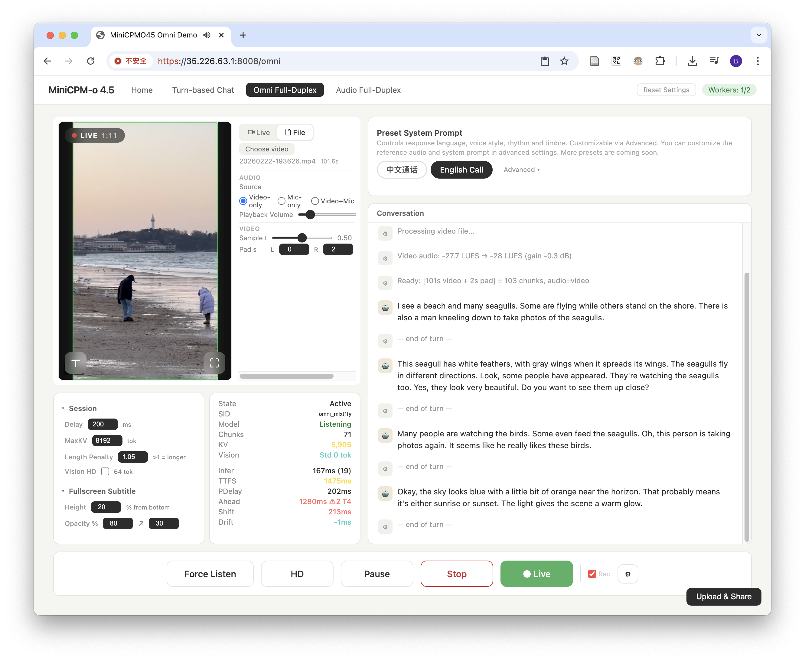

# MiniCPM-o 4.5 PyTorch Simple Demo System

[中文简介](README_zh.md) | [Documentation](https://minicpmo45.modelbest.cn/docs/en/) | [Realtime API Docs](https://minicpmo45.modelbest.cn/docs/en/realtime-api/overview/)

[Ready-to-use Demo Website](https://minicpmo45.modelbest.cn/) | [Discord](https://discord.gg/UTbTeCQe) | [Feishu Group](https://applink.feishu.cn/client/chat/chatter/add_by_link?link_token=228m5ca0-dfa1-464c-9406-b8b2f86d76ea)

This demo system is officially provided by the `MiniCPM-o 4.5` model training team. It uses a PyTorch + CUDA inference backend, combined with a lightweight frontend-backend design, aiming to demonstrate the full audio-video omnimodal full-duplex capabilities of MiniCPM-o 4.5 in a transparent, concise, and lossless manner.

## About MiniCPM-o 4.5

MiniCPM-o 4.5 is the latest and most capable model in the MiniCPM-o series. The model is built in an end-to-end fashion based on SigLip2, Whisper-medium, CosyVoice2, and Qwen3-8B with a total of 9B parameters. It exhibits a significant performance improvement, and introduces new features for full-duplex multimodal live streaming. Notable features of MiniCPM-o 4.5 include:

- 🔥 **Leading Visual Capability.** MiniCPM-o 4.5 achieves an average score of 77.6 on OpenCompass, a comprehensive evaluation of 8 popular benchmarks. With only 9B parameters, it surpasses widely used proprietary models like GPT-4o, Gemini 2.0 Pro, and approaches Gemini 2.5 Flash for vision-language capabilities. It supports instruct and thinking modes in a single model, better covering efficiency and performance trade-offs in different user scenarios.

- 🎙 **Strong Speech Capability.** MiniCPM-o 4.5 supports bilingual real-time speech conversation with configurable voices in English and Chinese. It features more natural, expressive and stable speech conversation. The model also allows for fun features such as voice cloning and role play via a simple reference audio clip, where the cloning performance surpasses strong TTS tools such as CosyVoice2.

- 🎬 **New Full-Duplex and Proactive Multimodal Live Streaming Capability.** As a new feature, MiniCPM-o 4.5 can process real-time, continuous video and audio input streams simultaneously while generating concurrent text and speech output streams in an end-to-end fashion, without mutual blocking. This allows MiniCPM-o 4.5 to see, listen, and speak simultaneously, creating a fluid, real-time omnimodal conversation experience. Beyond reactive responses, the model can also perform proactive interaction, such as initiating reminders or comments based on its continuous understanding of the live scene.

- 💪 **Strong OCR Capability, Efficiency and Others.** Advancing popular visual capabilities from MiniCPM-V series, MiniCPM-o 4.5 can process high-resolution images (up to 1.8 million pixels) and high-FPS videos (up to 10fps) in any aspect ratio efficiently. It achieves state-of-the-art performance for end-to-end English document parsing on OmniDocBench, outperforming proprietary models such as Gemini-3 Flash and GPT-5, and specialized tools such as DeepSeek-OCR 2. It also features trustworthy behaviors, matching Gemini 2.5 Flash on MMHal-Bench, and supports multilingual capabilities on more than 30 languages.

- 💫 **Easy Usage.** MiniCPM-o 4.5 can be easily used in various ways: Basic usage, recommended for 100% precision: PyTorch inference with Nvidia GPU. Other end-side adaptation includes (1) llama.cpp and Ollama support for efficient CPU inference on local devices, (2) int4 and GGUF format quantized models in 16 sizes, (3) vLLM and SGLang support for high-throughput and memory-efficient inference, (4) FlagOS support for the unified multi-chip backend plugin. We also open-sourced web demos which enable the full-duplex multimodal live streaming experience on local devices such as GPUs, PCs (e.g., on a MacBook).

<details>
<summary><b>Model Architecture</b></summary>

- **End-to-end Omni-modal Architecture.** The modality encoders/decoders and LLM are densely connected via hidden states in an end-to-end fashion. This enables better information flow and control, and also facilitates full exploitation of rich multimodal knowledge during training.

- **Full-Duplex Omni-modal Live Streaming Mechanism.** (1) We turn the offline modality encoder/decoders into online and full-duplex ones for streaming inputs/outputs. The speech token decoder models text and speech tokens in an interleaved fashion to support full-duplex speech generation (i.e., sync timely with new input). This also facilitates more stable long speech generation (e.g., > 1min). (2) We sync all the input and output streams on timeline in milliseconds, which are jointly modeled by a time-division multiplexing (TDM) mechanism for omni-modality streaming processing in the LLM backbone. It divides parallel omni-modality streams into sequential info groups within small periodic time slices.

- **Proactive Interaction Mechanism.** The LLM continuously monitors the input video and audio streams, and decides at a frequency of 1Hz to speak or not. This high decision-making frequency together with full-duplex nature are crucial to enable the proactive interaction capability.

- **Configurable Speech Modeling Design.** We inherit the multimodal system prompt design of MiniCPM-o 2.6, which includes a traditional text system prompt, and a new audio system prompt to determine the assistant voice. This enables cloning new voices and role play in inference time for speech conversation.

</details>

---

| Mode | Features | I/O Modalities | Paradigm
|------|----------|------|------
| **Turn-based Chat** | Low-latency streaming interaction; button-triggered responses; supports offline video/audio understanding and analysis; high response accuracy; strong basic capabilities | Audio + Text + Video input, Audio + Text output | Turn-based
| **Omnimodal Full-Duplex** | Real-time omnimodal full-duplex interaction; visual and voice input with simultaneous voice output; model autonomously decides when to speak; powerful cutting-edge capabilities | Vision + Audio input, Text + Voice output | Full-duplex
| **Audio Full-Duplex** | Real-time audio full-duplex interaction; voice input and voice output happen simultaneously; model autonomously decides when to speak; powerful cutting-edge capabilities | Audio input, Text + Voice output | Full-duplex

The 3 currently supported modes share a single model instance with millisecond-level hot-switching (< 0.1ms).

**Additional features:**

- Customizable system prompts
- Customizable reference audio
- Simple and readable codebase for continual development
- Serve as API backend for third-party applications



## Architecture

```
Frontend (HTML/JS)
    |  HTTPS / WSS
Gateway (:8006, HTTPS)
    |  HTTP / WS (internal)
Worker Pool (:22400+)
    +-- Worker 0 (GPU 0)
    +-- Worker 1 (GPU 1)
    +-- ...
```

- **Frontend** — Mode selection homepage, Turn-based Chat, Omni / Audio Duplex full-duplex interaction, Admin Dashboard
- **Gateway** — Request routing and dispatching, WebSocket proxy, request queuing and session affinity
- **Worker** — Each Worker occupies one GPU exclusively, supports Turn-based Chat / Duplex protocols, Duplex supports pause/resume (auto-release on timeout)


## Quick Start

### Check System Requirements
1. Make sure you have an NVIDIA GPU with more than 28GB of VRAM.
2. Make sure your machine is running a Linux operating system.

### Deployment Steps
The fastest deployment path is Docker Compose. For bare-metal deployment, use the Dockerfiles and entrypoints as the reference for dependencies and for the three startup stages: Gateway, Python Worker, and Backend.

**Deployment Architecture**

The current deployment is split into three runtime roles:

```text
Browser -> Gateway -> Python Worker -> Backend
```

- **Gateway** is the public HTTPS/WebSocket entrypoint. It does not load the model; it handles routing, queueing, session recording, and worker health checks.
- **Python Worker** exposes the worker WebSocket/health API, owns worker state, and forwards runtime protocol messages to a backend server.
- **Backend** runs the model. The backend can be the PyTorch implementation (`py_backend/server.py`) or the C++ implementation (`llama-omni-server` from `llama.cpp-omni`).

**Docker Deployment (Recommended)**

Docker Compose is the maintained quick-start deployment path. Use the Compose files for deployment, and refer to `docker-compose*.yml`, `docker/Dockerfile.*`, and `docker/entrypoint-*.sh` for the exact startup flow, ports, mounts, health checks, and backend arguments.

**Prerequisites:**
- Docker with the Compose v2 plugin
- [NVIDIA Container Toolkit](https://docs.nvidia.com/datacenter/cloud-native/container-toolkit/install-guide.html)
- One NVIDIA GPU per worker-backend instance
- Model weights mounted from the host; weights are not baked into images

**PyTorch backend via Compose:**

```bash
mkdir -p certs data
openssl req -x509 -newkey rsa:2048 -nodes -days 365 \
  -keyout certs/key.pem -out certs/cert.pem -subj "/CN=minicpm-o"

MODEL_HOST_PATH=/path/to/MiniCPM-o-4_5 docker compose up -d --build
docker compose logs -f gateway
docker compose logs -f worker-backend-0
```

Edit `docker-compose.yml` to match your GPU count. Use `docker-compose.multi.yml` only if you intentionally want multiple worker instances per GPU.

**C++ backend via Compose:**

```bash
mkdir -p certs data
openssl req -x509 -newkey rsa:2048 -nodes -days 365 \
  -keyout certs/key.pem -out certs/cert.pem -subj "/CN=minicpm-o"

GGUF_MODEL_HOST_PATH=/path/to/MiniCPM-o-4_5-gguf \
GATEWAY_HOST_PORT=8006 \
CPP_GPU_ID=0 \
docker compose -f docker-compose.cpp.yml up -d --build

docker compose -f docker-compose.cpp.yml logs -f gateway
docker compose -f docker-compose.cpp.yml logs -f cpp-worker-backend
```

For the C++ backend, `docker-compose.cpp.yml` is the intended entrypoint. It uses the C++ worker image defined by `docker/Dockerfile.cpp-worker-backend` and `docker/entrypoint-cpp-worker-backend.sh`. Read those files for the exact llama.cpp-omni ref, backend command, and default `LLAMA_SERVER_EXTRA_ARGS`.

**Bare-metal deployment:**

For bare-metal deployment, map the Docker dependencies and entrypoint commands to your host environment. Keep the same three-stage startup flow: Gateway, Python Worker, and Backend.

**Stop Docker services:**

```bash
docker compose down                      # PyTorch backend compose
docker compose -f docker-compose.cpp.yml down  # C++ backend compose
```

<br/>
<br/>


## C++ Backend (llama.cpp)

This demo also supports a **C++ inference backend** based on llama.cpp-omni. Use the Docker deployment section above as the authoritative setup path; inspect `docker-compose.cpp.yml` and `docker/Dockerfile.cpp-worker-backend` for startup details.

### Desktop App (Windows & macOS)

Ready-to-use desktop installers are available for Windows and macOS. Download from [llama.cpp-omni Releases](https://github.com/tc-mb/llama.cpp-omni/releases/).

---

## Project Structure

**Project Code Structure**
```
minicpmo45_service/
├── config.json               # Service config (copied from config.example.json, gitignored)
├── config.example.json       # Config example (full fields + defaults)
├── config.py                 # Config loading logic (Pydantic definition + JSON loading)
├── requirements.txt          # Python dependencies
├── docker-compose.yml        # Recommended PyTorch backend deployment
├── docker-compose.cpp.yml    # Recommended C++ backend deployment
├── docker-compose.multi.yml  # Multi-worker-per-GPU deployment variant
├── docker/                   # Dockerfiles and container entrypoints
│
├── gateway.py                # Gateway (routing, queuing, WS proxy)
├── worker.py                 # Worker (runtime protocol proxy)
├── gateway_modules/          # Gateway business modules
├── py_backend/               # PyTorch backend server
├── runtime/                  # Backend protocol client/session layer
│
├── core/                     # Core encapsulation
│   ├── schemas/              # Pydantic schemas (request/response)
│   └── processors/           # Inference processors (UnifiedProcessor)
│
├── MiniCPMO45/               # Model core inference code
├── static/                   # Frontend pages
├── resources/                # Resource files (reference audio, etc.)
└── tmp/                      # Runtime logs and PID files
```

## Configuration

`config.json` provides defaults for processes started directly on the host, or for containers when a file is mounted explicitly. Docker deployment does not copy the host `config.json` into images by default; Compose files, entrypoints, environment variables, and CLI arguments define the deployment behavior.

If you need bare-metal debugging, start from `config.example.json` and `config.py`. CLI arguments still take precedence over `config.json`, and missing fields fall back to Pydantic defaults.


## Resource Consumption

| Resource | Token2Wav (default) | + torch.compile |
|----------|---------------------|-----------------|
| VRAM (per Worker, after initialization) | ~21.5 GB | ~21.5 GB |
| Model loading time | ~16s | ~16s + ~5 min (warm) / ~15 min (cold) |
| Mode switching latency | < 0.1ms | < 0.1ms |
| Omni Full-Duplex per-unit latency (A100) | ~0.9s | **~0.5s** |
