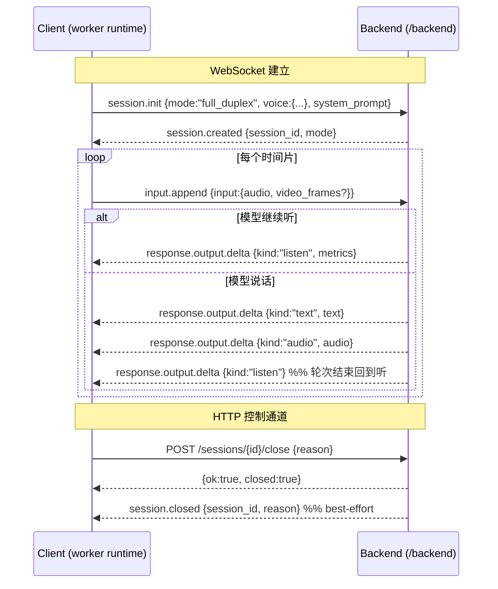
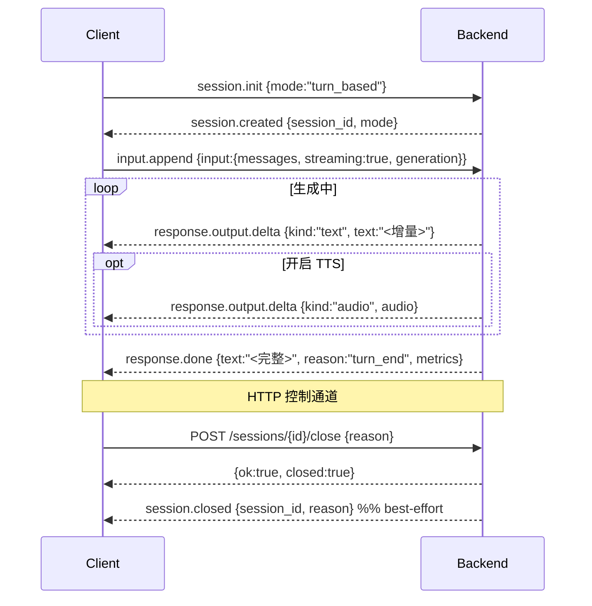
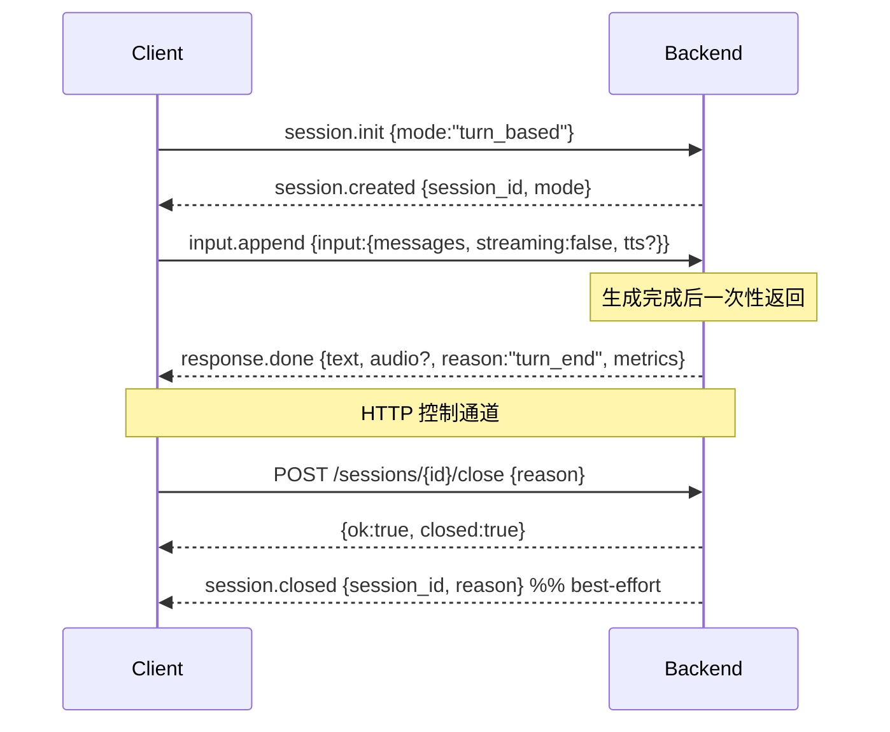

# Backend Server Protocol — 时序与示例

本文为 [Backend Server Network Protocol](./network.md)（过程/语义）
与 [Message Schema](./schema.md)（字段/编码）的配套，
以时序图和示例数据包演示三种交互：

- `full_duplex` —— 实时音视频
- `turn_based`（streaming）—— 流式对话
- `turn_based`（non-streaming）—— 一次性对话

> 示例中的 base64 音视频负载以 `...` 或 `<base64 f32 16k>` 省略；实际为 base64 字符串
> （音频见 schema §1.3：base64 裸 float PCM，示例抓包为 float32 / 16k / mono；图像见
> §1.4：JPEG）。每条下行事件实际还带 `server_send_ts`，示例中按需省略。

---

## 1. full_duplex

模型对持续输入的音视频时间片，自行在 listen / speak 间切换。一次 push = 一个时间片。

### 1.1 时序



### 1.2 示例数据包

init：`voice.ref_audio` 为 LLM 参考音频；`voice.tts_ref_audio` 为 TTS 音色，**可选**——
不传则 backend 复用 `ref_audio`（见 schema §3.1.1）。下例两者都给（TTS 用不同音色）：
```json
{
  "type": "session.init",
  "payload": {
    "mode": "full_duplex",
    "system_prompt": "你是一个有用的助手",
    "voice": {
      "ref_audio": "<base64 f32 16k>",
      "tts_ref_audio": "<base64 f32 16k>"
    }
  }
}
```
若 TTS 与 LLM 用同一音色，省略 `tts_ref_audio` 即可：`"voice": { "ref_audio": "<base64 f32 16k>" }`。

session.created：
```json
{
  "type": "session.created",
  "session_id": "sess_a1b2c3d4e5f6",
  "mode": "full_duplex",
  "metrics": { "backend": "pytorch", "kv_cache_length": 68 },
  "server_send_ts": 1780048876.4079616
}
```

push 一个时间片（音频 + 一帧视频）：
```json
{
  "type": "input.append",
  "input": {
    "audio": "<base64 f32 16k>",
    "video_frames": ["<jpeg base64>"],
    "max_slice_nums": 1
  }
}
```

listen 事件（模型继续听，无内容输出）：
```json
{
  "type": "response.output.delta",
  "kind": "listen",
  "session_id": "sess_a1b2c3d4e5f6",
  "metrics": {
    "backend": "pytorch", "kv_cache_length": 93,
    "prefill_ms": 79.0, "generate_ms": 1.7, "wall_clock_ms": 81.1
  },
  "server_send_ts": 1780048876.5141664
}
```

speak 事件（文字与音频是独立 delta）：
```json
{ "type": "response.output.delta", "kind": "text",
  "session_id": "sess_...", "response_id": "resp_ab12cd34ef56",
  "text": "你好", "metrics": { "wall_clock_ms": 350.0 } }
```
```json
{ "type": "response.output.delta", "kind": "audio",
  "session_id": "sess_...", "response_id": "resp_ab12cd34ef56",
  "audio": "<base64 f32 16k>", "metrics": { "wall_clock_ms": 352.0 } }
```

轮次结束（模型切回听）：
```json
{ "type": "response.output.delta", "kind": "listen",
  "session_id": "sess_...", "response_id": "resp_ab12cd34ef56" }
```

close（unary）：
```http
POST /sessions/sess_a1b2c3d4e5f6/close
Content-Type: application/json

{ "reason": "client_closed" }
```
```json
{ "ok": true, "session_id": "sess_a1b2c3d4e5f6", "closed": true }
```

---

## 2. turn_based（streaming）

一次请求，流式返回多个文字/音频 delta，最后一个 response.done 收尾。

### 2.1 时序



### 2.2 示例数据包

init：
```json
{ "type": "session.init", "payload": { "mode": "turn_based" } }
```

input（streaming = true）：
```json
{
  "type": "input.append",
  "input": {
    "messages": [
      { "role": "user", "content": [ { "type": "text", "text": "用一句话介绍北京" } ] }
    ],
    "streaming": true,
    "generation": { "max_new_tokens": 128, "length_penalty": 1.1 },
    "image": { "max_slice_nums": 1 },
    "tts": { "enabled": false }
  }
}
```

文字 delta（多条，需按序拼接）：
```json
{ "type": "response.output.delta", "kind": "text",
  "session_id": "sess_...", "response_id": "resp_...", "text": "北京是" }
```
```json
{ "type": "response.output.delta", "kind": "text",
  "session_id": "sess_...", "response_id": "resp_...", "text": "中国的首都。" }
```

response.done（text 为完整拼接）：
```json
{
  "type": "response.done",
  "session_id": "sess_...", "response_id": "resp_...",
  "text": "北京是中国的首都。",
  "reason": "turn_end",
  "metrics": { "backend": "pytorch", "kv_cache_length": 142,
               "generate_ms": 820.5, "n_tokens": 9 }
}
```

close（unary，与 §1 相同；close 只走 HTTP，不在 WS 上发）：
```http
POST /sessions/sess_a1b2c3d4e5f6/close
Content-Type: application/json

{ "reason": "turn_done" }
```

---

## 3. turn_based（non-streaming）

一次请求，单个 response.done 返回全部内容（不发增量 delta）。

### 3.1 时序



### 3.2 示例数据包

input（streaming = false，开启 TTS）：
```json
{
  "type": "input.append",
  "input": {
    "messages": [
      { "role": "user", "content": [ { "type": "text", "text": "请只回答：测试" } ] }
    ],
    "streaming": false,
    "generation": { "max_new_tokens": 32, "length_penalty": 1.1 },
    "tts": { "enabled": true, "ref_audio_data": "<base64 f32 16k>" }
  }
}
```

response.done（一次性，含合成音频）：
```json
{
  "type": "response.done",
  "session_id": "sess_...", "response_id": "resp_...",
  "text": "测试",
  "audio": "<base64 f32 16k>",
  "reason": "turn_end",
  "metrics": { "backend": "pytorch", "generate_ms": 240.0 }
}
```

> 非流式不发 `response.output.delta`，全部内容在单个 `response.done` 中：
> `text` 为完整文本，`audio` 为完整音频（未开 TTS 时为 `null`）。

---

## 4. 多模态输入示例（messages content 项）

turn_based 的 `messages[].content` 可混合多种内容项（编码见 schema §1.3/§1.4/§4.4）：

```json
{
  "role": "user",
  "content": [
    { "type": "text",  "text": "描述这张图和这段话" },
    { "type": "image", "data": "<jpeg base64>" },
    { "type": "audio", "data": "<base64 f32 16k>" },
    { "type": "video", "data": "<base64 mp4 容器文件>", "stack_frames": 1 }
  ]
}
```

> `image` 是单张 JPEG（§1.4）；`video` 的 `data` 是**完整 MP4 容器文件**的 base64，
> 由 backend 解码抽帧+音频（§4.4），与 full_duplex 的 JPEG `video_frames` 不同。
