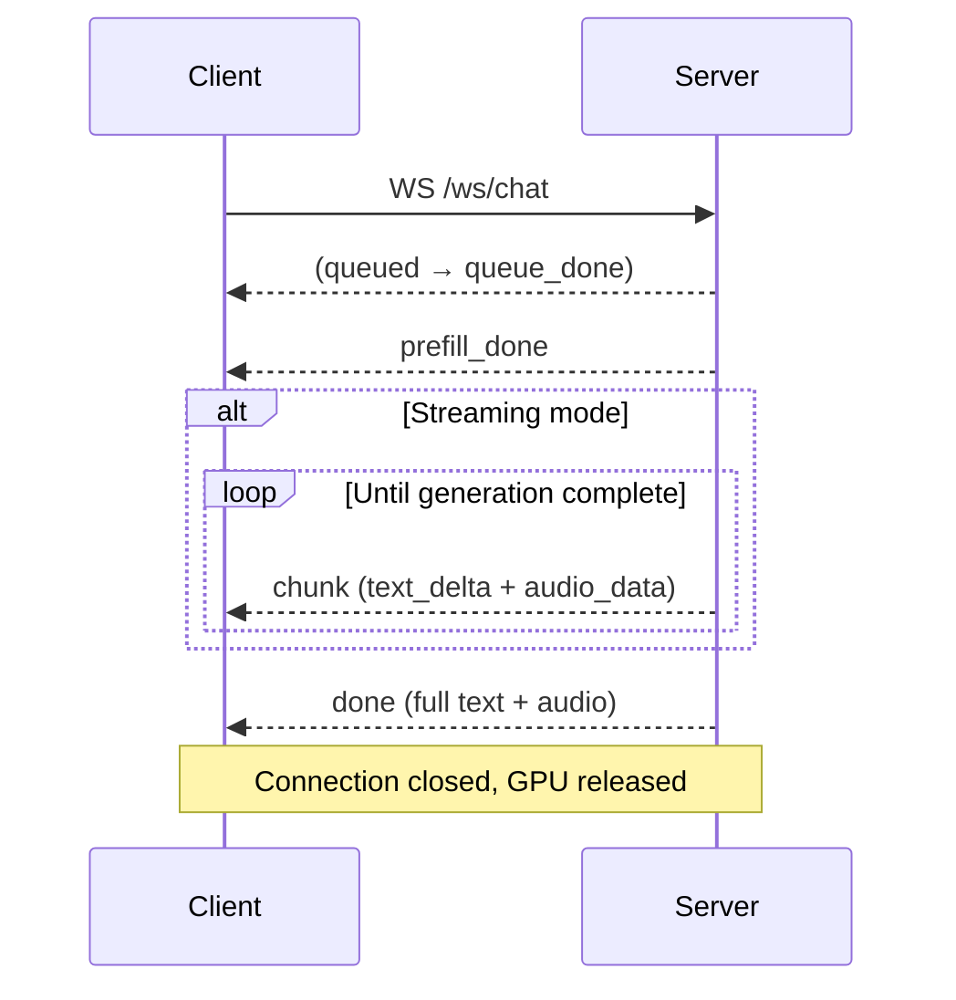

# Chat Mode (Turn-based Chat)

## Audio Format Specification

| Direction | Format | Sample Rate | Channels | Encoding |
|-----------|--------|-------------|----------|----------|
| Client → Server | PCM Float32 | 16000 Hz | Mono | Base64 |
| Server → Client | PCM Float32 | 24000 Hz | Mono | Base64 |

Base64 encodes the raw bytes of the Float32 array directly (not WAV, not Opus).

---

## Common Data Types

### Message

```json
{
  "role": "system | user | assistant",
  "content": "plain text string"
}
```

`content` can also be a multimodal content list:

```json
{
  "role": "user",
  "content": [
    {"type": "text", "text": "Describe this image"},
    {"type": "image", "data": "<base64>"},
    {"type": "audio", "data": "<base64 PCM float32>", "sample_rate": 16000},
    {"type": "video", "data": "<base64 video file>", "stack_frames": 1}
  ]
}
```

| Content Type | Required Fields | Optional Fields | Description |
|-------------|----------------|-----------------|-------------|
| `text` | `text` | — | Text content |
| `image` | `data` (Base64) | — | Image content |
| `audio` | `data` (Base64 PCM float32) | `sample_rate` (default: 16000) | Audio content |
| `video` | `data` (Base64 video file) | `stack_frames` (default: 1) | Video content; frames and audio are auto-extracted |

### GenerationConfig

| Field | Type | Default | Description |
|-------|------|---------|-------------|
| `max_new_tokens` | int | 512 | Maximum number of tokens to generate |
| `temperature` | float | 0.7 | Sampling temperature |
| `top_p` | float | 0.8 | Top-P (nucleus) sampling |
| `length_penalty` | float | 1.0 | Length penalty coefficient |

### TTSConfig

| Field | Type | Default | Description |
|-------|------|---------|-------------|
| `enabled` | bool | true | Enable voice output |
| `mode` | string | `"default"` | TTS mode: `default`, `audio_assistant`, `omni`, `audio_roleplay`, `voice_cloning` |
| `ref_audio_path` | string | — | Server-side reference audio path |
| `ref_audio_data` | string | — | Base64-encoded reference audio (takes precedence over `ref_audio_path`) |
| `language` | string | — | Language hint |

### ImageConfig

| Field | Type | Default | Description |
|-------|------|---------|-------------|
| `max_slice_nums` | int | null | Maximum image slices for high-resolution processing |
| `use_image_id` | bool | true | Assign image IDs in multi-image contexts |

---

### Overview

Turn-based Chat provides stateless multimodal dialogue with support for text, image, audio, and video inputs. It supports both **streaming** (token-by-token) and **non-streaming** (one-shot) generation.

Each request is stateless — the server performs a full prefill of all messages without reusing KV Cache from previous requests. The GPU is released immediately after inference completes, making it the most resource-efficient mode.

**Capabilities**: Text + Image + Audio + Video input, Text + Audio output, streaming output, multi-turn dialogue (client-managed history).

### Lifecycle



**Phase 1 — Request & Queue**: Client opens a WebSocket connection and sends the request. The server places it in a shared FIFO queue. When a GPU Worker becomes available, the request is dequeued and processing begins.

**Phase 2 — Prefill**: All messages are encoded and fed into the model in one shot. Upon completion, the server sends `prefill_done` with `input_tokens` count. This phase is the main latency contributor — it scales with total input size including images and audio.

**Phase 3 — Generation**: In streaming mode, the model generates tokens one by one, sending each as a `chunk` message containing `text_delta` and optionally `audio_data`. In non-streaming mode, all tokens are generated internally and only the final result is returned. Streaming mode provides much lower time-to-first-token.

**Phase 4 — Completion**: The server sends `done` with the full generated text, audio data, and token statistics. The WebSocket connection closes. The GPU Worker is returned to the pool.

**Error handling**: If any error occurs during processing, the server sends an `error` message and closes the connection. The GPU Worker is still released.

### WebSocket — wss://host/ws/chat

Turn-based Chat via WebSocket, supporting both streaming and non-streaming modes. Delivers incremental results in real time.

#### Full Session Lifecycle

1. Client opens WebSocket connection to `wss://host/ws/chat`.
2. Client sends **one** JSON message containing the full request (messages, config, etc.).
3. Server enqueues the request. If the queue is not empty, the client waits.
4. Server performs prefill and sends `prefill_done`.
5. If `streaming: true`, server sends a sequence of `chunk` messages as tokens are generated.
6. Server sends `done` with the complete result.
7. Connection closes automatically.

If an error occurs at any stage, the server sends `error` and closes the connection.

#### Client → Server

One JSON message sent immediately after connection:

```json
{
  "messages": [
    {"role": "user", "content": "Hello!"}
  ],
  "streaming": true,
  "generation": {"max_new_tokens": 256, "length_penalty": 1.1},
  "tts": {"enabled": true, "ref_audio_data": "<base64>"},
  "image": {"max_slice_nums": null},
  "omni_mode": false,
  "enable_thinking": false
}
```

| Field | Type | Default | Description |
|-------|------|---------|-------------|
| `messages` | Message[] | — | Conversation messages |
| `streaming` | bool | true | Enable streaming output (token-by-token) |
| `generation` | GenerationConfig | — | Generation parameters |
| `tts` | TTSConfig | — | TTS configuration |
| `image` | ImageConfig | — | Image processing parameters |
| `omni_mode` | bool | false | Enable omni mode for video input |
| `enable_thinking` | bool | false | Enable thinking mode |

#### Server → Client

Messages arrive in strict order: `prefill_done` → (`chunk`...) → `done`.

| Message Type | Key Fields | Description |
|-------------|-----------|-------------|
| `prefill_done` | `input_tokens` | Prefill complete; generation starting |
| `chunk` | `text_delta`, `audio_data` | One streaming token (only when `streaming: true`). `text_delta` is the incremental text; `audio_data` is the corresponding audio segment (may be null for some chunks) |
| `done` | `text`, `generated_tokens`, `input_tokens`, `audio_data`, `recording_session_id` | Generation complete. `text` contains the full accumulated text; `audio_data` contains the full audio (in non-streaming mode) or the final segment (in streaming mode) |
| `error` | `error` | Error message; connection will close |

**`chunk` example**:
```json
{
  "type": "chunk",
  "text_delta": "Hello",
  "audio_data": "<base64, 24kHz>"
}
```

**`done` example**:
```json
{
  "type": "done",
  "text": "Hello! How can I help you?",
  "generated_tokens": 15,
  "input_tokens": 42,
  "audio_data": "<base64, 24kHz>",
  "recording_session_id": "chat_abc123"
}
```

### Example: Full Lifecycle

**JavaScript**

```javascript
// -- Reference audio for voice cloning (base64 PCM float32, 16kHz) --
// Loaded from an uploaded file or the server default (/api/default_ref_audio).
const refAudioBase64 = getRefAudioBase64();

const ws = new WebSocket(`wss://${location.host}/ws/chat`);
let fullText = '';

ws.onopen = () => {
  const payload = {
    messages: [
      // System message uses content-list format: [text, audio, text].
      // The audio item embeds the reference voice into the LLM context.
      { role: 'system', content: [
        { type: 'text', text: 'Mimic the voice from the audio sample.' },
        { type: 'audio', data: refAudioBase64 },          // reference voice
        { type: 'text', text: 'You are a helpful assistant. Reply naturally.' },
      ]},
      { role: 'user', content: 'Hello!' },
    ],
    streaming: true,
    generation: { max_new_tokens: 256, temperature: 0.7 },
    tts: {
      enabled: true,
      mode: 'audio_assistant',
      ref_audio_data: refAudioBase64,  // same audio initializes TTS vocoder
    },
  };
  ws.send(JSON.stringify(payload));
};

ws.onmessage = (event) => {
  const msg = JSON.parse(event.data);
  switch (msg.type) {
    case 'prefill_done':
      // Server finished prefilling the prompt into KV Cache
      console.log(`Prefill done, ${msg.input_tokens} input tokens`);
      break;
    case 'chunk':
      // Streaming token: incremental text and/or audio segment
      if (msg.text_delta) {
        fullText += msg.text_delta;
        console.log('Streaming:', fullText);
      }
      if (msg.audio_data) playAudio(msg.audio_data);  // PCM float32, 24kHz
      break;
    case 'done':
      // Generation complete — full text and token stats
      console.log('Final text:', msg.text);
      console.log(`Tokens: ${msg.input_tokens} in, ${msg.generated_tokens} out`);
      ws.close();
      break;
    case 'error':
      console.error('Error:', msg.error);
      ws.close();
      break;
  }
};

ws.onerror = () => console.error('WebSocket error');
ws.onclose = () => console.log('Connection closed');
```

**Python**

```python
import asyncio, json, base64
import numpy as np
import websockets

def load_ref_audio(path: str) -> str:
    """Load a WAV file and return base64-encoded PCM float32 at 16kHz."""
    import soundfile as sf
    audio, _ = sf.read(path, dtype="float32", samplerate=16000)
    return base64.b64encode(audio.tobytes()).decode()

async def chat_streaming(
    server_url="wss://localhost:8006/ws/chat",
    ref_audio_path: str | None = "ref.wav",
):
    async with websockets.connect(server_url) as ws:
        # Load reference audio for voice cloning
        ref_b64 = load_ref_audio(ref_audio_path) if ref_audio_path else None

        # System message uses content-list format: [text, audio, text].
        # The audio item embeds the reference voice into the LLM context.
        system_content = "You are a helpful assistant."
        if ref_b64:
            system_content = [
                {"type": "text", "text": "Mimic the voice from the audio sample."},
                {"type": "audio", "data": ref_b64},          # reference voice
                {"type": "text", "text": "You are a helpful assistant. Reply naturally."},
            ]

        # TTS config — ref_audio_data initializes the TTS vocoder separately
        tts_config = {"enabled": True, "mode": "audio_assistant"}
        if ref_b64:
            tts_config["ref_audio_data"] = ref_b64

        await ws.send(json.dumps({
            "messages": [
                {"role": "system", "content": system_content},
                {"role": "user", "content": "Hello!"},
            ],
            "streaming": True,
            "generation": {"max_new_tokens": 256, "temperature": 0.7},
            "tts": tts_config,
        }))

        full_text = ""
        audio_chunks = []

        async for raw in ws:
            msg = json.loads(raw)
            if msg["type"] == "prefill_done":
                print(f"Prefill done, {msg['input_tokens']} input tokens")
            elif msg["type"] == "chunk":
                # Incremental text token
                if msg.get("text_delta"):
                    full_text += msg["text_delta"]
                    print(f"Streaming: {full_text}")
                # Incremental audio segment (PCM float32, 24kHz)
                if msg.get("audio_data"):
                    audio_chunks.append(base64.b64decode(msg["audio_data"]))
            elif msg["type"] == "done":
                print(f"Final: {msg['text']}")
                print(f"Tokens: {msg['input_tokens']} in, {msg['generated_tokens']} out")
                break
            elif msg["type"] == "error":
                print(f"Error: {msg['error']}")
                break

        if audio_chunks:
            pcm = np.frombuffer(b"".join(audio_chunks), dtype=np.float32)
            print(f"Received {len(pcm)/24000:.1f}s of audio")

asyncio.run(chat_streaming())
```

### Processor Method Chain

The internal processing pipeline for each Chat request:

| Step | Method | Description |
|------|--------|-------------|
| 1 | `UnifiedProcessor.set_chat_mode()` | Switch to Chat mode (< 0.1ms hot-switch), returns `ChatView` |
| 2 | `ChatView.prefill(session_id, msgs, ...)` | Encode all messages (text, image, audio, video) and fill into KV Cache in one shot |
| 3a | `ChatView.streaming_generate(session_id, ...)` | Streaming path: yields `StreamingChunk` objects one by one, each containing a text token and optional audio segment |
| 3b | `ChatView.generate(session_id, ...)` | Non-streaming path: runs HuggingFace `generate()` internally, then TTS, returns the complete result |

