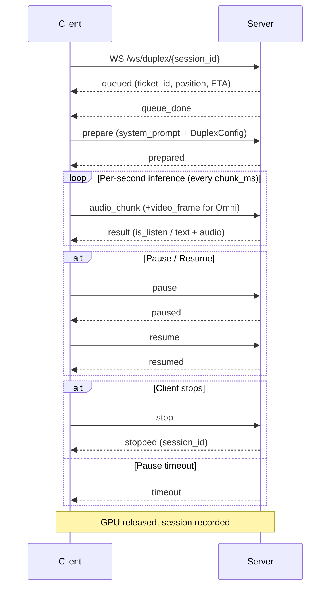

# Duplex Mode (Full-Duplex)

### Overview

Duplex mode enables simultaneous input and output — the user can speak (and optionally show video) while the model generates audio responses at the same time. The system runs a **per-second inference loop**: every second, the user's audio (and optionally a video frame) is fed to the model, which then decides autonomously whether to **listen** (stay silent and absorb input) or **speak** (generate text + audio output).

Two variants share the same WebSocket endpoint, differing only in input modalities:

| Variant | Input | What client sends each second |
|---------|-------|-------------------------------|
| **Omnimodal Full-Duplex** | Voice + Camera | `audio_chunk` + `video_frame` |
| **Audio Full-Duplex** | Voice only | `audio_chunk` only |

The GPU Worker is exclusively occupied for the entire session. Unlike Half-Duplex, there is no explicit VAD — the model itself decides when to speak based on the audio content, using learned listen/speak probabilities.

**Capabilities**: Voice (+ Vision) input → Text + Voice output, autonomous listen/speak decisions, interrupt support, pause/resume, exclusive GPU Worker.

### Lifecycle



**Phase 1 — Connection & Queue**: Client connects to `wss://host/ws/duplex/{session_id}` with a unique session ID. The session ID prefix determines the variant: `omni_*` for Omnimodal, `audio_duplex_*` for Audio-only. The server enqueues the request and sends `queued` with `ticket_id`, `position`, and `eta_seconds`. While waiting, the client may receive periodic `queue_update` messages. When assigned, the client receives `queue_done`.

**Phase 2 — Preparation**: Client sends `prepare` with the system prompt, DuplexConfig parameters, and optionally a reference audio path. The server initializes the duplex session: loads TTS, prefills the system prompt, and sets up internal state. The client receives `prepared`. Audio capture should now begin.

**Phase 3 — Per-Second Inference Loop**: The core of duplex mode. Every `chunk_ms` milliseconds (default 1000ms), the client sends an `audio_chunk` (and a `video_frame` for Omni). The server processes each chunk through a three-step pipeline:

1. **Prefill**: The audio waveform (and video frames) are encoded and appended to the KV Cache.
2. **Generate**: The model produces one generation step. It outputs either a **listen** decision (stay silent, continue absorbing input) or a **speak** decision (emit text tokens + audio).
3. **Finalize**: Post-generation bookkeeping (update turn state, handle end-of-turn).

The client receives a `result` message for each step.

**Startup protection (`force_listen_count`)**: For the first N steps (default 3), the model is forced to listen regardless of its internal state. This prevents the model from speaking before it has received enough context.

**Listen/Speak behavior**: When `result.is_listen` is `true`, the model heard the audio but chose to stay silent — `text` and `audio_data` will be empty. When `is_listen` is `false`, the model is speaking — `text` contains generated tokens and `audio_data` contains the corresponding audio. Multiple consecutive `is_listen: false` results form a continuous speaking turn. When `end_of_turn` becomes `true`, the model has finished its current speaking turn and transitions back to listening.

**Interrupt (`set_break`)**: If the client detects that the user started speaking while the model is mid-speech (based on input audio energy or VAD on the client side), it can keep sending `audio_chunk`. The model may naturally transition from speaking back to listening on the next step — this is the "barge-in" / interrupt behavior.

**Phase 4 — Pause / Resume**: Client can send `pause` to temporarily suspend the session (e.g., when the user switches tabs). The server responds with `paused`. No `audio_chunk` should be sent during pause. To resume, send `resume`; the server responds with `resumed`. If the session remains paused for longer than the `pause_timeout` (default 60 seconds), the server sends `timeout` and releases the GPU automatically.

**Phase 5 — Termination**: The session ends when:
- **Client stop**: Client sends `stop`. Server responds with `stopped` containing the `session_id`.
- **Pause timeout**: Server sends `timeout` after the pause timeout expires.
- **Connection drop**: If the WebSocket disconnects unexpectedly, the server cleans up the session.

After termination, GPU memory is released and the session recording is finalized.

### WebSocket — wss://host/ws/duplex/{session_id}

#### Client → Server

| Message Type | Key Fields | When to send | Description |
|-------------|-----------|-------------|-------------|
| `prepare` | `prefix_system_prompt`, `config`, `ref_audio_path` | Once, after `queue_done` | Initialize the duplex session with system prompt and configuration |
| `audio_chunk` | `audio` (Base64) | Every `chunk_ms` ms, after `prepared` | Send one chunk of microphone audio (PCM float32, 16kHz). Chunk duration should match `config.chunk_ms` (default 1s) |
| `video_frame` | `frame` (Base64 JPEG) | With each `audio_chunk` (Omni only) | Send a camera frame. Only for Omnimodal variant |
| `pause` | — | Any time during active session | Temporarily suspend the session. Stop sending `audio_chunk` |
| `resume` | — | After `paused` received | Resume a paused session. Start sending `audio_chunk` again |
| `stop` | — | Any time | Gracefully stop the session and release GPU |
| `client_diagnostic` | `metrics` | Periodically (optional) | Client-side diagnostic metrics for monitoring |

**`prepare` example**:

```json
{
  "type": "prepare",
  "prefix_system_prompt": "You are a fun assistant.",
  "config": {
    "generate_audio": true,
    "chunk_ms": 1000,
    "temperature": 0.7,
    "top_p": 0.8,
    "top_k": 20,
    "force_listen_count": 3,
    "max_new_speak_tokens_per_chunk": 20,
    "listen_prob_scale": 1.0,
    "ls_mode": "explicit",
    "sample_rate": 16000
  },
  "ref_audio_path": "assets/ref_audio/ref_minicpm_signature.wav"
}
```

**DuplexConfig fields**:

| Field | Type | Default | Description |
|-------|------|---------|-------------|
| `generate_audio` | bool | true | Generate audio output. When false, only text is produced |
| `ls_mode` | string | `"explicit"` | Listen/Speak decision mode. Controls how the model decides between listening and speaking |
| `force_listen_count` | int | 3 | Startup protection: force the model to listen for the first N steps, preventing premature speech before context is established |
| `max_new_speak_tokens_per_chunk` | int | 20 | Maximum speak tokens per inference step. Limits how much text is generated per second to maintain real-time pacing |
| `temperature` | float | 0.7 | Sampling temperature for text generation |
| `top_k` | int | 20 | Top-K sampling |
| `top_p` | float | 0.8 | Top-P (nucleus) sampling |
| `listen_prob_scale` | float | 1.0 | Scale factor for listen probability. Values > 1.0 make the model more likely to listen (less talkative); < 1.0 makes it more eager to speak |
| `chunk_ms` | int | 1000 | Audio chunk duration in milliseconds. Determines the per-second loop cadence. Client must send audio chunks at this interval |
| `sample_rate` | int | 16000 | Expected audio sample rate |

**`audio_chunk` example**:
```json
{
  "type": "audio_chunk",
  "audio": "<base64 PCM float32, 16kHz, 1s>"
}
```

**`video_frame` example**:
```json
{
  "type": "video_frame",
  "frame": "<base64 JPEG>"
}
```

#### Server → Client

Messages follow the lifecycle order. During the active loop, `result` messages arrive at the cadence of `chunk_ms`.

| Message Type | Key Fields | Lifecycle Phase | Description |
|-------------|-----------|----------------|-------------|
| `queued` | `ticket_id`, `position`, `eta_seconds` | Connection | Enqueued; waiting for GPU |
| `queue_update` | `position`, `eta_seconds` | Connection | Queue position changed |
| `queue_done` | — | Connection | GPU assigned. Client should send `prepare` |
| `prepared` | — | Preparation | Session ready. Client should begin sending `audio_chunk` |
| `result` | `is_listen`, `text`, `audio_data`, `end_of_turn`, timing fields | Active loop | Per-step inference result. See DuplexGenerateResult below |
| `paused` | — | Pause | Session paused |
| `resumed` | — | Resume | Session resumed |
| `stopped` | `session_id` | Termination | Session stopped; GPU released |
| `timeout` | — | Termination | Pause timeout expired; GPU released |
| `error` | `message` | Any | Error; connection will close |

**DuplexGenerateResult fields** (the `result` message payload):

| Field | Type | Description |
|-------|------|-------------|
| `is_listen` | bool | `true` = model chose to listen (silent). `false` = model chose to speak (generating output) |
| `text` | string | Generated text tokens. Empty string when `is_listen: true` |
| `audio_data` | string | Base64 audio at 24kHz. Empty string when `is_listen: true`. Client should play this audio immediately |
| `end_of_turn` | bool | `true` when the model finishes its speaking turn and transitions back to listening. Only meaningful when `is_listen: false` |
| `current_time` | int | Cumulative session time in milliseconds |
| `cost_llm_ms` | float | LLM inference latency for this step (ms) |
| `cost_tts_ms` | float | TTS synthesis latency for this step (ms) |
| `cost_all_ms` | float | Total step latency including prefill + generate + finalize (ms). Should stay under `chunk_ms` for real-time performance |
| `n_tokens` | int | Number of LLM tokens generated in this step |
| `n_tts_tokens` | int | Number of TTS tokens generated in this step |
| `server_send_ts` | float | Server-side send timestamp (unix seconds). Used for client-side latency measurement |

**`result` example (speaking)**:
```json
{
  "type": "result",
  "is_listen": false,
  "text": "Hello",
  "audio_data": "<base64, 24kHz>",
  "end_of_turn": false,
  "current_time": 5000,
  "cost_llm_ms": 45.2,
  "cost_tts_ms": 12.3,
  "cost_all_ms": 78.5,
  "n_tokens": 3,
  "server_send_ts": 1708771200.123
}
```

**`result` example (listening)**:
```json
{
  "type": "result",
  "is_listen": true,
  "text": "",
  "audio_data": "",
  "end_of_turn": false,
  "current_time": 3000,
  "cost_llm_ms": 12.1,
  "cost_tts_ms": 0,
  "cost_all_ms": 35.4,
  "n_tokens": 1,
  "server_send_ts": 1708771197.456
}
```

### Example: Full Lifecycle

**JavaScript — Audio Duplex**

```javascript
const sessionId = 'adx_' + Date.now().toString(36);
const ws = new WebSocket(`wss://${location.host}/ws/duplex/${sessionId}`);
let currentText = '';

// -- Reference audio for voice cloning (base64 PCM float32, 16kHz) --
const refAudioBase64 = getRefAudioBase64();

ws.onopen = () => console.log('Connected, waiting for queue...');

ws.onmessage = (event) => {
  const msg = JSON.parse(event.data);
  switch (msg.type) {
    case 'queued':
      console.log(`Queue #${msg.position}, ETA: ${msg.eta_seconds}s`);
      break;
    case 'queue_update':
      console.log(`Queue moved to #${msg.position}`);
      break;

    case 'queue_done':
      // GPU assigned — send prepare with ref audio for voice cloning.
      // ref_audio_base64 is used for both LLM system prompt embedding and TTS voice.
      // To use a different voice for TTS, set tts_ref_audio_base64 separately.
      ws.send(JSON.stringify({
        type: 'prepare',
        prefix_system_prompt: 'You are a fun assistant.',
        ref_audio_base64: refAudioBase64,
        config: {
          generate_audio: true,
          chunk_ms: 1000,
          temperature: 0.7,
          force_listen_count: 3,
        },
      }));
      break;

    case 'prepared':
      console.log('Session ready, starting audio capture');
      startPerSecondCapture();
      break;

    case 'result':
      // Per-second inference result: model decides to listen or speak
      if (msg.is_listen) {
        console.log(`[${msg.current_time}ms] Listening (${msg.cost_all_ms.toFixed(0)}ms)`);
      } else {
        currentText += msg.text;
        console.log(`[${msg.current_time}ms] Speaking: "${msg.text}" (${msg.cost_all_ms.toFixed(0)}ms)`);
        if (msg.audio_data) playAudio(msg.audio_data);  // PCM float32, 24kHz
        if (msg.end_of_turn) {
          console.log(`Turn ended. Full text: "${currentText}"`);
          currentText = '';
        }
      }
      break;

    case 'paused':
      console.log('Session paused');
      break;
    case 'resumed':
      console.log('Session resumed');
      break;
    case 'stopped':
      console.log(`Session stopped: ${msg.session_id}`);
      break;
    case 'timeout':
      console.log('Pause timeout — session ended');
      break;
    case 'error':
      console.error('Error:', msg.message);
      break;
  }
};

async function startPerSecondCapture() {
  const stream = await navigator.mediaDevices.getUserMedia({ audio: { sampleRate: 16000 } });
  const ctx = new AudioContext({ sampleRate: 16000 });
  await ctx.audioWorklet.addModule('capture-processor.js');
  const source = ctx.createMediaStreamSource(stream);
  const node = new AudioWorkletNode(ctx, 'capture-processor', {
    processorOptions: { chunkSize: 16000 }  // 1 second of audio at 16kHz
  });
  source.connect(node);

  // AudioWorklet is event-driven, NOT timer-based:
  // The audio rendering thread accumulates mic samples in real-time and fires
  // 'chunk' exactly when 1 second of audio is ready. No sleep or setInterval needed.
  node.port.onmessage = (e) => {
    if (e.data.type === 'chunk' && ws.readyState === WebSocket.OPEN) {
      const msg = {
        type: 'audio_chunk',
        audio: arrayBufferToBase64(e.data.audio.buffer),
      };
      // For Omni variant, additionally attach video frames:
      // msg.frame_base64_list = [captureFrameAsJpegBase64()];
      ws.send(JSON.stringify(msg));
    }
  };
}

function pauseSession()  { ws.send(JSON.stringify({ type: 'pause' })); }
function resumeSession() { ws.send(JSON.stringify({ type: 'resume' })); }
function stopSession()   { ws.send(JSON.stringify({ type: 'stop' })); }
```

**Python**

```python
import asyncio, json, base64, time
import numpy as np
import websockets

def load_ref_audio(path: str) -> str:
    """Load a WAV file and return base64-encoded PCM float32 at 16kHz."""
    import soundfile as sf
    audio, _ = sf.read(path, dtype="float32", samplerate=16000)
    return base64.b64encode(audio.tobytes()).decode()

def audio_file_to_1s_chunks(path, sr=16000):
    """Read audio and yield 1-second float32 chunks as base64."""
    import soundfile as sf
    audio, _ = sf.read(path, dtype="float32", samplerate=sr)
    for i in range(0, len(audio), sr):
        yield base64.b64encode(audio[i:i + sr].tobytes()).decode()

async def duplex_session(
    audio_path: str,
    server="wss://localhost:8006",
    ref_audio_path: str | None = "ref.wav",
):
    session_id = f"adx_{int(time.time()*1000):x}"
    url = f"{server}/ws/duplex/{session_id}"

    async with websockets.connect(url) as ws:
        # 1. Wait for queue assignment
        while True:
            msg = json.loads(await ws.recv())
            if msg["type"] == "queue_done":
                break

        # 2. Prepare — attach ref audio for voice cloning.
        #    ref_audio_base64: used for both LLM system prompt embedding and TTS voice.
        #    To use a different TTS voice, set tts_ref_audio_base64 separately.
        prepare_msg = {
            "type": "prepare",
            "prefix_system_prompt": "You are a fun assistant.",
            "config": {
                "generate_audio": True,
                "chunk_ms": 1000,
                "temperature": 0.7,
                "force_listen_count": 3,
            },
        }
        if ref_audio_path:
            prepare_msg["ref_audio_base64"] = load_ref_audio(ref_audio_path)
        await ws.send(json.dumps(prepare_msg))

        msg = json.loads(await ws.recv())
        assert msg["type"] == "prepared"
        print("Session ready")

        # 3. Concurrently send audio and receive results
        async def send_audio():
            for chunk_b64 in audio_file_to_1s_chunks(audio_path):
                await ws.send(json.dumps({
                    "type": "audio_chunk",
                    "audio": chunk_b64,
                }))
                # Simulate real-time microphone cadence: in a browser, the
                # AudioWorklet fires chunk events driven by the audio rendering
                # thread — no sleep needed. Here we sleep because we're reading
                # from a file and need to match the server's per-second loop.
                await asyncio.sleep(1.0)
            # Allow server to finish processing the last chunks
            await asyncio.sleep(3)
            await ws.send(json.dumps({"type": "stop"}))

        async def recv_results():
            current_text = ""
            async for raw in ws:
                msg = json.loads(raw)
                if msg["type"] == "result":
                    t = msg["current_time"]
                    if msg["is_listen"]:
                        print(f"[{t}ms] Listening ({msg['cost_all_ms']:.0f}ms)")
                    else:
                        current_text += msg.get("text", "")
                        print(f"[{t}ms] Speaking: {msg.get('text', '')!r} ({msg['cost_all_ms']:.0f}ms)")
                        if msg["end_of_turn"]:
                            print(f"  Turn ended: {current_text!r}")
                            current_text = ""
                elif msg["type"] in ("stopped", "timeout"):
                    print(f"Session ended: {msg['type']}")
                    break

        await asyncio.gather(send_audio(), recv_results())

asyncio.run(duplex_session("test_audio.wav"))
```

### Processor Method Chain

The internal processing pipeline for each second of a Duplex session:

| Phase | Method | Description |
|-------|--------|-------------|
| Init | `UnifiedProcessor.set_duplex_mode()` | Switch to Duplex mode (< 0.1ms), returns `DuplexView` |
| Prepare | `DuplexView.prepare(system_prompt, ref_audio_path, prompt_wav_path)` | Initialize session: prefill system prompt, load TTS reference audio |
| Each step | `DuplexView.prefill(audio_waveform, frame_list, ...)` | Encode and append 1-second audio (+ video frames) to KV Cache |
| Each step | `DuplexView.generate(force_listen)` | Run one generation step. Returns `DuplexGenerateResult` with listen/speak decision, text, audio, and timing |
| Each step | `DuplexView.finalize()` | Post-generation bookkeeping: update turn counters, handle deferred finalization if end_of_turn |
| Interrupt | `DuplexView.set_break()` / `clear_break()` | Set or clear the interrupt flag. When set, the model will transition to listening on the next step |
| Terminate | `DuplexView.stop()` | Signal the session to stop |
| Cleanup | `DuplexView.cleanup()` | Release GPU memory, clear KV Cache, finalize session state |

