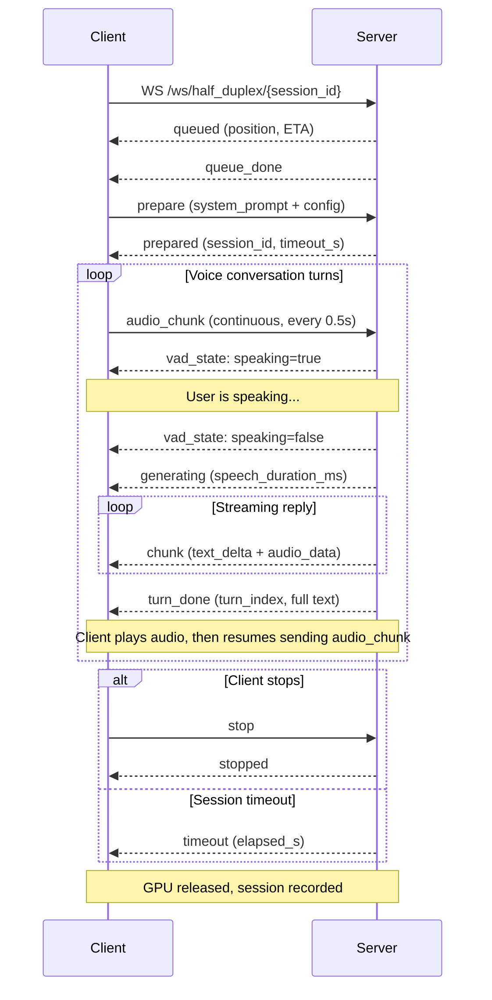

# Half-Duplex Mode (VAD-based Voice Conversation)

### Overview

Half-Duplex mode implements hands-free voice conversation with automatic turn-taking. The server runs **SileroVAD** (Voice Activity Detection) to detect when the user starts and stops speaking. After the user finishes, the model generates a streaming reply. Once playback completes, the system resumes listening — like a phone call where each side takes turns.

Unlike Chat mode, Half-Duplex is a **stateful, long-lived session**. The GPU Worker is exclusively occupied for the entire session (default 3-minute timeout). KV Cache persists across turns, so the model accumulates context from the full conversation history without re-encoding previous turns.

**Capabilities**: Voice input → Text + Voice output, streaming output, multi-turn context accumulation, KV Cache persistence, exclusive GPU Worker.

### Lifecycle



**Phase 1 — Connection & Queue**: Client connects to `wss://host/ws/half_duplex/{session_id}` with a unique session ID. The server places the request in the FIFO queue. The client receives `queued` with its position and estimated wait time. When a GPU Worker becomes available, the client receives `queue_done`.

**Phase 2 — Preparation**: Client sends `prepare` with the system prompt, VAD parameters, generation config, TTS settings, and optionally a reference audio for voice cloning. The server initializes: (1) loads the SileroVAD ONNX model, (2) prefills the system prompt into KV Cache, (3) initializes TTS with the reference audio, (4) starts the session recorder. The client receives `prepared` with the assigned `session_id`, `timeout_s`, and `recording_session_id`.

**Phase 3 — Listening Loop**: Client begins sending `audio_chunk` messages continuously (every 0.5 seconds, float32 PCM 16kHz). The server feeds each chunk into StreamingVAD. When speech is detected, the server sends `vad_state: {speaking: true}`. The client should display a "listening" indicator.

**Cold start guard**: For the first 0.5 seconds after `prepared`, all VAD results are ignored to filter out microphone initialization noise.

**Phase 4 — Speech End & Generation**: When VAD detects sustained silence (configurable via `min_silence_duration_ms`, default 800ms), the accumulated speech segment is finalized. The server sends `vad_state: {speaking: false}` followed immediately by `generating` with `speech_duration_ms`. The speech segment is encoded as audio content and prefilled into KV Cache, then streaming generation begins. Each generated token produces a `chunk` message with `text_delta` and `audio_data`.

**Phase 5 — Turn Completion**: When generation finishes, the server sends `turn_done` with the `turn_index` (0-based counter) and the full `text` of this turn. The client should play back all received audio. During playback, the client **must stop sending `audio_chunk`** to prevent echo feedback (the model would otherwise hear its own voice). After playback completes, the client waits an additional ~800ms buffer, then resumes sending `audio_chunk` to start the next turn.

**Phase 6 — Termination**: The session ends in one of three ways:
- **Client stop**: Client sends `stop`. Server sends `stopped` and releases the GPU.
- **Timeout**: If no `audio_chunk` is received for `timeout_s` seconds (default 180), the server sends `timeout` with `elapsed_s` and releases the GPU.
- **External stop**: An HTTP `POST /api/half_duplex/stop` with the `session_id` forces generation to stop mid-turn.

After termination, the session recording is finalized and available for playback.

### WebSocket — wss://host/ws/half_duplex/{session_id}

#### Client → Server

| Message Type | Key Fields | Description |
|-------------|-----------|-------------|
| `prepare` | `system_prompt`, `config`, `ref_audio_base64`, `system_content` | Initialize session; must be the first message after `queue_done` |
| `audio_chunk` | `audio_base64` | Send microphone audio (float32 PCM 16kHz, ~0.5s per chunk). Must be sent continuously during listening phase. Must **stop** during AI audio playback to prevent echo |
| `stop` | — | Gracefully stop the session and release GPU |

**`prepare` example**:

```json
{
  "type": "prepare",
  "system_prompt": "You are a helpful assistant.",
  "config": {
    "vad": {
      "threshold": 0.8,
      "min_speech_duration_ms": 128,
      "min_silence_duration_ms": 800,
      "speech_pad_ms": 30
    },
    "generation": {
      "max_new_tokens": 256,
      "length_penalty": 1.1,
      "temperature": 0.7
    },
    "tts": {
      "enabled": true
    },
    "session": {
      "timeout_s": 180
    }
  },
  "ref_audio_base64": "<base64 reference audio>"
}
```

**`config` fields**:

| Category | Field | Default | Description |
|----------|-------|---------|-------------|
| `vad` | `threshold` | 0.8 | Speech probability threshold. SileroVAD slides a 1024-sample window and outputs a probability per window. Values >= threshold mark "speech started". Higher values reduce false triggers but may miss soft speech |
| `vad` | `min_speech_duration_ms` | 128 | Minimum speech duration to be considered valid. Segments shorter than this are discarded as noise |
| `vad` | `min_silence_duration_ms` | 800 | Sustained silence required to confirm end of speech. Lower values make turn-taking faster but risk cutting off pauses mid-sentence |
| `vad` | `speech_pad_ms` | 30 | Padding added to each side of the detected speech segment to avoid clipping word boundaries |
| `generation` | `max_new_tokens` | 256 | Maximum tokens per turn |
| `generation` | `length_penalty` | 1.1 | Length penalty coefficient (> 1.0 encourages longer responses) |
| `generation` | `temperature` | 0.7 | Sampling temperature |
| `tts` | `enabled` | true | Enable voice response. When false, only text is generated |
| `session` | `timeout_s` | 180 | Session timeout in seconds. Timer resets on each `audio_chunk` received |

**`audio_chunk` example**:
```json
{
  "type": "audio_chunk",
  "audio_base64": "<base64 PCM float32, 16kHz, ~0.5s>"
}
```

#### Server → Client

Messages follow a strict lifecycle order within each turn:

| Message Type | Key Fields | Lifecycle Phase | Description |
|-------------|-----------|----------------|-------------|
| `queued` | `position`, `estimated_wait_s` | Connection | Request placed in queue |
| `queue_done` | — | Connection | Queue exited; GPU Worker assigned. Client should now send `prepare` |
| `prepared` | `session_id`, `timeout_s`, `recording_session_id` | Preparation | Session initialized. System prompt prefilled, VAD ready, TTS loaded. Client should begin sending `audio_chunk` |
| `vad_state` | `speaking` (bool) | Listening | VAD state transition. `true` = speech detected (user started talking). `false` = speech ended (user stopped talking) |
| `generating` | `speech_duration_ms` | Turn start | Server is processing the speech segment and starting generation |
| `chunk` | `text_delta`, `audio_data` | Generation | One streaming chunk. `text_delta` is incremental text; `audio_data` is the corresponding audio segment at 24kHz. Client should buffer and play audio in order |
| `turn_done` | `turn_index`, `text` | Turn end | Turn generation complete. `text` is the full response text for this turn. Client should finish playing buffered audio, then resume sending `audio_chunk` after a ~800ms delay |
| `timeout` | `elapsed_s` | Termination | Session timed out due to inactivity. Connection will close |
| `error` | `error` | Any | Error occurred. Connection will close |

**`turn_done` example**:
```json
{
  "type": "turn_done",
  "turn_index": 2,
  "text": "Sure, I can help you with that."
}
```

### REST — POST /api/half_duplex/stop

Force-stop an ongoing half-duplex generation from outside the WebSocket connection. Useful for implementing a "stop" button in the UI that operates independently of the audio stream.

**Request Body**:
```json
{"session_id": "stream_abc123"}
```

### Example: Full Lifecycle

**JavaScript**

```javascript
const sessionId = 'hdx_' + Math.random().toString(36).slice(2, 10);
const ws = new WebSocket(`wss://${location.host}/ws/half_duplex/${sessionId}`);
let aiSpeaking = false;
let audioContext, captureNode;

// -- Reference audio for voice cloning (base64 PCM float32, 16kHz) --
const refAudioBase64 = getRefAudioBase64();

ws.onopen = () => console.log('Connected, waiting for queue...');

ws.onmessage = (event) => {
  const msg = JSON.parse(event.data);
  switch (msg.type) {
    case 'queued':
      console.log(`Queue position: #${msg.position}, ETA: ${msg.estimated_wait_s}s`);
      break;

    case 'queue_done':
      // GPU assigned — send prepare with system_content containing ref audio.
      // system_content follows the model's best practice: [text, audio, text].
      // The audio item embeds the reference voice used for both LLM context and TTS cloning.
      ws.send(JSON.stringify({
        type: 'prepare',
        system_content: [
          { type: 'text', text: 'Mimic the voice from the audio sample.' },
          { type: 'audio', data: refAudioBase64 },         // reference voice
          { type: 'text', text: 'You are a helpful assistant. Reply naturally.' },
        ],
        config: {
          vad: { threshold: 0.8, min_silence_duration_ms: 800 },
          generation: { max_new_tokens: 256, temperature: 0.7 },
          tts: { enabled: true },
          session: { timeout_s: 180 },
        },
      }));
      break;

    case 'prepared':
      console.log(`Session ready (timeout: ${msg.timeout_s}s)`);
      startMicCapture();  // begin sending audio_chunk
      break;

    case 'vad_state':
      // Server-side VAD detected speech start / end
      console.log(msg.speaking ? 'User speaking...' : 'User stopped');
      break;

    case 'generating':
      // Server is processing user speech and starting generation.
      // Stop sending audio to prevent echo feedback.
      aiSpeaking = true;
      console.log(`Generating (speech: ${msg.speech_duration_ms}ms)`);
      break;

    case 'chunk':
      // Streaming token: incremental text and/or audio segment
      if (msg.text_delta) process.stdout.write(msg.text_delta);
      if (msg.audio_data) playAudio(msg.audio_data);  // PCM float32, 24kHz
      break;

    case 'turn_done':
      // Turn complete — resume mic after playback finishes + 800ms buffer
      // to avoid capturing the AI's own audio output.
      console.log(`\nTurn ${msg.turn_index} done: ${msg.text}`);
      setTimeout(() => { aiSpeaking = false; }, getPlaybackRemaining() + 800);
      break;

    case 'timeout':
      console.log(`Session timed out (${msg.elapsed_s}s)`);
      break;
    case 'error':
      console.error('Error:', msg.error);
      break;
  }
};

async function startMicCapture() {
  const stream = await navigator.mediaDevices.getUserMedia({ audio: { sampleRate: 16000 } });
  audioContext = new AudioContext({ sampleRate: 16000 });
  await audioContext.audioWorklet.addModule('capture-processor.js');
  const source = audioContext.createMediaStreamSource(stream);
  captureNode = new AudioWorkletNode(audioContext, 'capture-processor');
  source.connect(captureNode);

  // AudioWorklet is event-driven, NOT timer-based:
  // The audio rendering thread accumulates mic samples and fires 'chunk'
  // when the buffer reaches ~0.5s. No sleep or polling needed.
  captureNode.port.onmessage = (e) => {
    if (e.data.type === 'chunk' && !aiSpeaking && ws.readyState === WebSocket.OPEN) {
      ws.send(JSON.stringify({
        type: 'audio_chunk',
        audio_base64: float32ToBase64(e.data.audio),
      }));
    }
  };
}

function stopSession() {
  ws.send(JSON.stringify({ type: 'stop' }));
  ws.close();
}
```

**Python**

```python
import asyncio, json, base64
import numpy as np
import websockets

def load_ref_audio(path: str) -> str:
    """Load a WAV file and return base64-encoded PCM float32 at 16kHz."""
    import soundfile as sf
    audio, _ = sf.read(path, dtype="float32", samplerate=16000)
    return base64.b64encode(audio.tobytes()).decode()

def audio_file_to_chunks(path, chunk_duration=0.5, sr=16000):
    """Read a WAV file and yield 0.5s float32 chunks as base64."""
    import soundfile as sf
    audio, _ = sf.read(path, dtype="float32", samplerate=sr)
    chunk_size = int(sr * chunk_duration)
    for i in range(0, len(audio), chunk_size):
        yield base64.b64encode(audio[i:i + chunk_size].tobytes()).decode()

async def half_duplex_session(
    audio_path: str,
    server="wss://localhost:8006",
    ref_audio_path: str | None = "ref.wav",
):
    session_id = f"hdx_{id(object()):x}"
    url = f"{server}/ws/half_duplex/{session_id}"

    async with websockets.connect(url) as ws:
        # 1. Wait for queue assignment
        while True:
            msg = json.loads(await ws.recv())
            if msg["type"] == "queue_done":
                break
            print(f"Queued at #{msg.get('position')}")

        # 2. Prepare — system_content embeds reference audio for voice cloning.
        #    Format follows model best practice: [text, audio, text].
        ref_b64 = load_ref_audio(ref_audio_path) if ref_audio_path else None
        system_content = [
            {"type": "text", "text": "Mimic the voice from the audio sample."},
            {"type": "audio", "data": ref_b64},         # reference voice
            {"type": "text", "text": "You are a helpful assistant. Reply naturally."},
        ] if ref_b64 else None

        prepare_msg = {
            "type": "prepare",
            "config": {
                "vad": {"threshold": 0.8, "min_silence_duration_ms": 800},
                "generation": {"max_new_tokens": 256, "temperature": 0.7},
                "tts": {"enabled": True},
                "session": {"timeout_s": 60},
            },
        }
        if system_content:
            prepare_msg["system_content"] = system_content
        await ws.send(json.dumps(prepare_msg))

        msg = json.loads(await ws.recv())
        assert msg["type"] == "prepared"
        print(f"Session ready: {msg['session_id']}")

        # 3. Concurrently send audio and receive responses
        async def send_audio():
            for chunk_b64 in audio_file_to_chunks(audio_path):
                await ws.send(json.dumps({
                    "type": "audio_chunk",
                    "audio_base64": chunk_b64,
                }))
                # Simulate real-time microphone cadence: in a browser, the
                # AudioWorklet fires chunk events driven by the audio rendering
                # thread — no sleep needed. Here we sleep because we're reading
                # from a file and need to pace the chunks to match real time.
                await asyncio.sleep(0.5)
            # Wait for the server to finish generating the final turn
            await asyncio.sleep(5)
            await ws.send(json.dumps({"type": "stop"}))

        async def recv_messages():
            async for raw in ws:
                msg = json.loads(raw)
                if msg["type"] == "vad_state":
                    print("Speaking..." if msg["speaking"] else "Stopped speaking")
                elif msg["type"] == "generating":
                    print(f"Generating ({msg['speech_duration_ms']}ms speech)")
                elif msg["type"] == "chunk":
                    if msg.get("text_delta"):
                        print(msg["text_delta"], end="", flush=True)
                elif msg["type"] == "turn_done":
                    print(f"\n--- Turn {msg['turn_index']} done ---")
                elif msg["type"] in ("stopped", "timeout"):
                    break

        await asyncio.gather(send_audio(), recv_messages())

asyncio.run(half_duplex_session("test_audio.wav"))
```

### Processor Method Chain

The internal processing pipeline for a Half-Duplex session:

| Phase | Method | Description |
|-------|--------|-------------|
| Init | `UnifiedProcessor.set_half_duplex_mode()` | Switch to Half-Duplex mode (< 0.1ms), returns `HalfDuplexView` |
| Init | `HalfDuplexView.init_ref_audio(path)` or `init_ref_audio_from_data(ndarray)` | Load reference audio for TTS voice cloning |
| Prepare | `HalfDuplexView.prefill(request)` | Prefill system prompt into KV Cache; creates a rollback snapshot |
| Each turn | `HalfDuplexView.prefill(request)` | Prefill user speech segment into KV Cache |
| Each turn | `HalfDuplexView.generate(session_id, ...)` | Streaming generation, yields `StreamingChunk` with text + audio |
| Recovery | `HalfDuplexView.can_rollback()` → `rollback()` | Check if rollback is possible, then restore KV Cache to last snapshot (e.g., on generation error) |
| Recovery | `HalfDuplexView.clear_rollback_point()` | Discard the snapshot after a successful turn |

