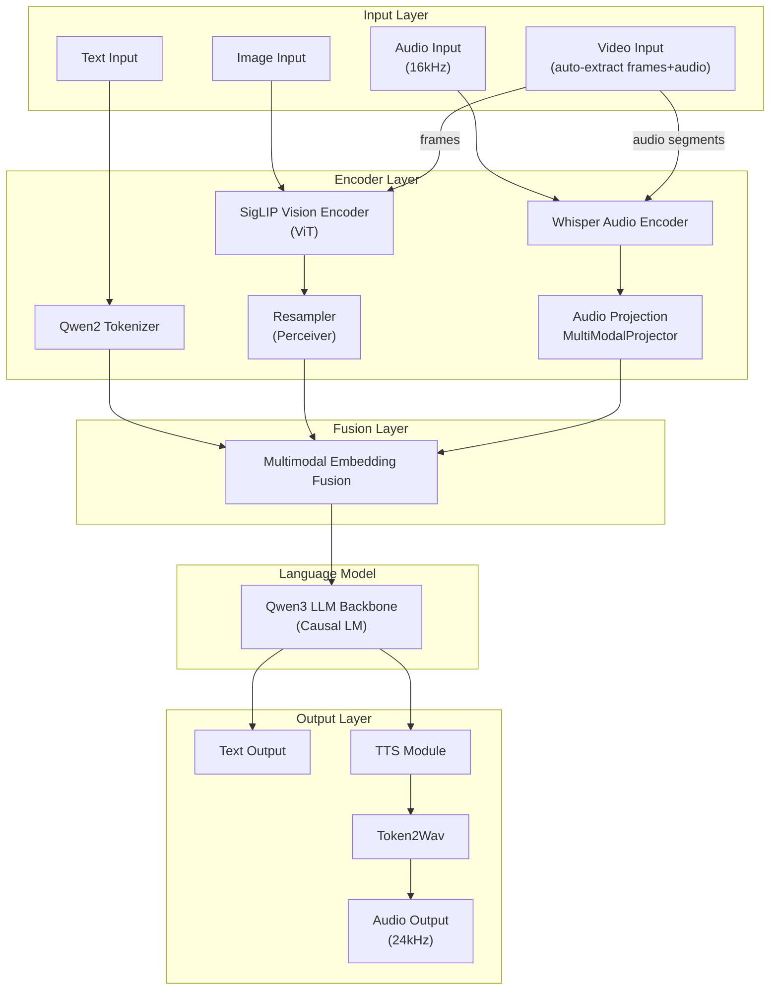

# MiniCPMO45 Model Module Details

MiniCPMO45 is the system's core model module, implementing multimodal large language model inference capabilities with support for text, image, audio, and video input, as well as text and audio output.

## Module Structure

```
MiniCPMO45/
├── configuration_minicpmo.py       # Model configuration definitions
├── modeling_minicpmo.py            # Main model implementation
├── modeling_minicpmo_unified.py    # Unified model (supports hot-switching)
├── modeling_navit_siglip.py        # SigLIP vision encoder
├── processing_minicpmo.py          # Multimodal processor
├── tokenization_minicpmo_fast.py   # Fast tokenizer
├── utils.py                        # Utility functions
├── tokenizer_config.json           # Tokenizer configuration
├── generation_config.json          # Generation configuration
├── preprocessor_config.json        # Preprocessor configuration
├── special_tokens_map.json         # Special token mapping
└── added_tokens.json               # Extended tokens
```

## Multimodal Architecture Overview



---

## Core Model Structure

`MiniCPMO` is the central class of the system (inherits from `Qwen3PreTrainedModel`), composed of 6 sub-modules, each responsible for a specific modality or function:

- **`llm`** — `Qwen3ForCausalLM`, the language model backbone that performs causal reasoning and text generation on fused multimodal embeddings.
- **`vpm`** — `SiglipVisionTransformer`, the vision encoder that encodes image patches into visual feature sequences.
- **`resampler`** — `Resampler` (Perceiver-style cross-attention) that compresses variable-length visual features into a fixed number of query vectors.
- **`apm`** — `MiniCPMWhisperEncoder`, the audio encoder (based on Whisper) that encodes mel spectrograms into audio features.
- **`audio_projection_layer`** — `MultiModalProjector` (Linear → ReLU → Linear) that maps audio features into the LLM's embedding space.
- **`tts`** — `MiniCPMTTS`, the text-to-speech module that converts LLM hidden states into audio tokens.

Each sub-module can be independently enabled or disabled via the `init_vision` / `init_audio` / `init_tts` configuration flags.

### Unified Model and Mode Switching

The `MiniCPMO` in `modeling_minicpmo_unified.py` extends the base model with **unified mode management**, supporting hot-switching between three modes via the `ProcessorMode` enum:

- **`CHAT`** — Standard multimodal chat with image/audio/video input and text or speech output.
- **`STREAMING`** — Streaming chat with chunk-by-chunk input and streaming output.
- **`DUPLEX`** — Full-duplex real-time conversation with simultaneous listening and speaking.

Switching is done via `set_mode(mode)`, which only resets session state (KV Cache, Token2Wav cache, etc.) without reloading model weights, making mode transitions extremely lightweight.

---

## Input Encoding

### Text Encoding

Text input is tokenized by the Qwen2 Tokenizer, then converted to embedding vectors via `llm.model.embed_tokens`. An optional `scale_emb` scaling factor is applied after embedding.

### Vision Encoding (Image and Video)

Image processing follows three steps:

1. **Image Slicing** (`MiniCPMVImageProcessor`) — Large images are sliced into multiple patches according to `MiniCPMVSliceConfig` (up to `max_slice_nums=9` patches, each `448x448`), while retaining a global thumbnail. This enables the model to handle high-resolution images.
2. **VPM Encoding** (`SiglipVisionTransformer`) — Each patch is encoded by the SigLIP ViT. The ViT consists of `SiglipVisionEmbeddings` (Conv2d patch embedding + positional encoding) and multi-layer `SiglipEncoder` (multi-head self-attention + FFN), with Flash Attention 2 support. The output is a variable-length patch feature sequence.
3. **Resampler Compression** (`Resampler`) — Learnable query vectors (64 by default) perform cross-attention over the VPM output, compressing variable-length visual features into a fixed length. Positional information is injected via 2D sincos positional encoding. Output shape: `(num_queries, embed_dim)`.

**Video** is decomposed into a frame sequence + audio segments. Frames follow the vision encoding path; audio segments follow the audio encoding path.

### Audio Encoding

Audio processing follows three steps:

1. **Mel Spectrogram Extraction** (`MiniCPMAAudioProcessor`) — 16kHz audio input is converted to 80-dimensional mel spectrogram features.
2. **APM Encoding** (`MiniCPMWhisperEncoder`) — A Whisper-based encoder that first downsamples via two 1D convolutions (Conv1 stride=1 → GELU → Conv2 stride=2), then processes through multi-layer Transformer encoder layers. Supports KV Cache for streaming audio encoding, with optional context overlap via `prefix_extra_frames` / `suffix_extra_frames`.
3. **Projection + Pooling** — `MultiModalProjector` (Linear → ReLU → Linear) maps audio features to the LLM embedding dimension, followed by `AvgPool1d` (stride `audio_pool_step=5`) to further compress the sequence length.

---

## Multimodal Embedding Fusion

After each modality is encoded, they are merged into a unified embedding sequence through two steps:

1. **Vision Fusion** (`get_vllm_embedding`) — Vision placeholder tokens are reserved in the text sequence. Using `image_bound` (which records the start and end positions of each image placeholder), the corresponding text embeddings are **replaced** with the Resampler's visual embeddings via a scatter operation.
2. **Audio Fusion** (`get_omni_embedding`) — On the vision-fused sequence, `audio_bounds` (which records the start and end positions of audio placeholders) is used to **replace** the corresponding embeddings with the audio encoder's output embeddings.

The result is a unified `inputs_embeds` (containing text + vision + audio) that is fed into the LLM for causal reasoning.

---

## Language Model Inference

The fused `inputs_embeds` is fed into `Qwen3ForCausalLM` for autoregressive generation. The LLM is modality-agnostic — all modalities share the same embedding space after fusion.

Text generation supports two modes:

- **Standard generation** — The `_decode` method generates the complete output at once.
- **Streaming generation** — The `_decode_stream` method returns tokens incrementally, supporting `ChunkPrefillChunkGenerate` for chunked prefill and chunked generation.

---

## Output Generation

### Text Output

The LLM directly outputs a token sequence, which is decoded into text by the Tokenizer.

### Text-to-Speech (TTS)

When speech output is needed, the LLM's hidden states are converted to audio tokens by the `MiniCPMTTS` module, then synthesized into waveforms by a vocoder.

**MiniCPMTTS Architecture**:

- **`emb_text`** — Text embedding layer that encodes the input text condition.
- **`emb_code`** — Audio codebook embedding layer that encodes previously generated audio tokens.
- **`model`** — `LlamaModel` serving as the TTS Transformer backbone.
- **`head_code`** — Linear prediction head that outputs the probability distribution for the next audio token.

The input layout is `[Text BOS | Speaker Embedding | Text Tokens | Audio BOS | Audio Tokens...]`, and the model autoregressively predicts the audio token sequence.

**Four attention modes** (configured via `attention_type`):

- **`full_attention`** — Full attention with the highest accuracy but largest memory footprint.
- **`sliding_window`** — Sliding window that truncates KV Cache beyond the window, balancing accuracy and efficiency.
- **`sliding_recompute`** — Sliding recompute (default) that retains only the in-window KV Cache and recomputes each step, achieving a good balance between accuracy and efficiency.
- **`reindex`** — RoPE reindexing that adjusts positional encoding to accommodate window truncation (experimental).

**Token2Wav Vocoder** — Converts the TTS audio tokens into 24kHz waveforms. Supports both streaming (chunk-by-chunk conversion) and non-streaming (batch conversion) modes.

---

## Duplex Capability (DuplexCapability)

`DuplexCapability` is a **composition component** (not inherited) that references the main `MiniCPMO` model's parameters via `self.model`, accessed as `model.duplex`. It implements real-time listen-speak interaction.

### Three-Step Workflow

1. **`prepare`** — Initializes the duplex session. Prefills the system prompt into the KV Cache, loads TTS reference audio (for voice cloning), and registers special tokens (`<|listen|>`, `<|speak|>`, `<|tts_bos|>`, `<|tts_eos|>`, etc.).
2. **`streaming_prefill`** — Chunk-by-chunk prefill. At each time step, audio features and/or video frames are encoded and fed into the KV Cache, keeping the model continuously "listening" to input.
3. **`streaming_generate`** — Step-by-step generation. At each step, the model decides whether to continue "listening" (output listen token) or start "speaking" (output speak token followed by text and audio tokens). Generated audio tokens are converted to waveforms in real-time via Token2Wav.

### Sliding Window Strategies

During long duplex conversations, the KV Cache grows continuously. Sliding window strategies control memory usage:

- **`basic`** — Basic sliding window that retains only the most recent N tokens in the KV Cache.
- **`context`** — Context sliding window that retains the system prompt + the most recent N tokens, ensuring the model always remembers the system instructions.

---

## Configuration Reference

### MiniCPMOConfig

Inherits from `Qwen3Config` and contains four sub-configurations:

- `vision_config: SiglipVisionConfig` — Vision encoder configuration
- `audio_config: WhisperConfig` — Audio encoder configuration
- `tts_config: MiniCPMTTSConfig` — TTS module configuration
- `slice_config: MiniCPMVSliceConfig` — Image slicing configuration

**Key parameters**:

- `query_num = 64` — Number of Resampler query vectors
- `image_size = 448` — Default image size
- `drop_vision_last_layer = True` — Drop the last layer of the vision encoder
- `vision_batch_size = 16` — Vision batch processing size
- `audio_pool_step = 5` — Audio feature pooling step
- `audio_chunk_length = 1.0` — Audio chunk length (seconds)
- `init_vision = True` — Whether to initialize the vision encoder
- `init_audio = True` — Whether to initialize the audio encoder
- `init_tts = True` — Whether to initialize the TTS module

### MiniCPMTTSConfig

- `llm_dim = 2560` — LLM projection dimension
- `hidden_size = 768` — TTS hidden layer size
- `num_hidden_layers = 20` — Number of TTS Transformer layers
- `num_attention_heads = 12` — Number of attention heads
- `num_audio_tokens = 4097` — Audio token vocabulary size
- `num_text_tokens = 21178` — Text token vocabulary size
- `streaming = True` — Whether to enable streaming mode
- `attention_type = "sliding_recompute"` — Attention type
- `window_size = 2` — Sliding window size
