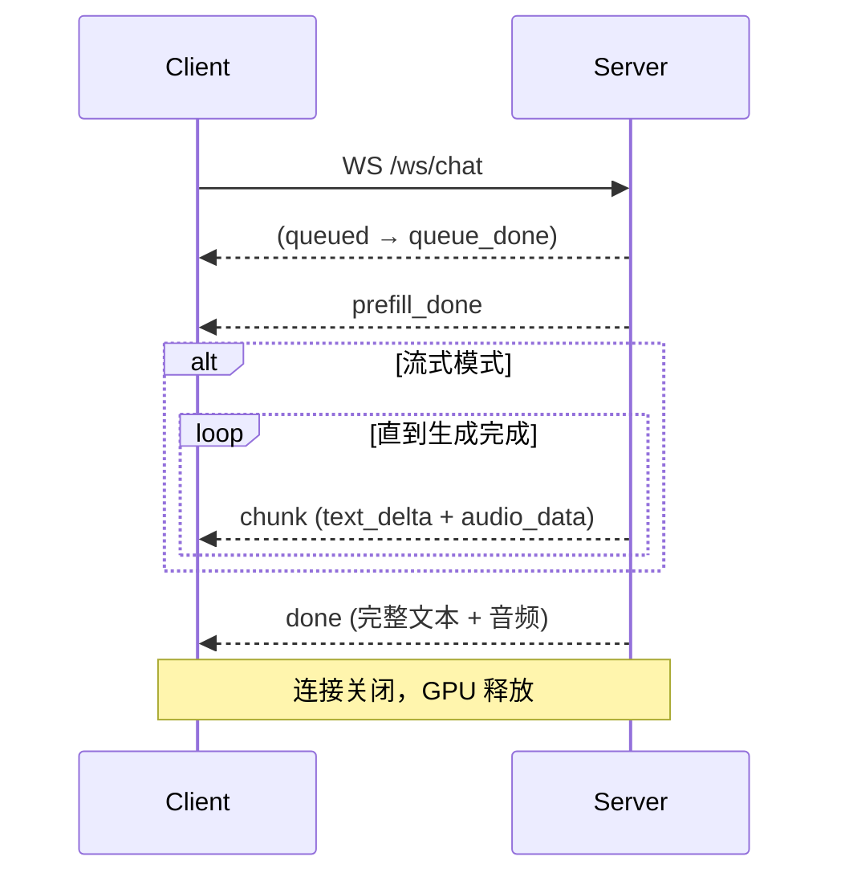

# Chat 模式（Turn-based Chat）

## 音频格式规范

| 方向 | 格式 | 采样率 | 声道 | 编码 |
|------|------|--------|------|------|
| 客户端 → 服务端 | PCM Float32 | 16000 Hz | 单声道 | Base64 |
| 服务端 → 客户端 | PCM Float32 | 24000 Hz | 单声道 | Base64 |

Base64 直接编码 Float32 数组的原始字节（非 WAV，非 Opus）。

---

## 通用数据类型

### Message

```json
{
  "role": "system | user | assistant",
  "content": "纯文本字符串"
}
```

`content` 也可以是多模态内容列表：

```json
{
  "role": "user",
  "content": [
    {"type": "text", "text": "描述这张图片"},
    {"type": "image", "data": "<base64>"},
    {"type": "audio", "data": "<base64 PCM float32>", "sample_rate": 16000},
    {"type": "video", "data": "<base64 video file>", "stack_frames": 1}
  ]
}
```

| 内容类型 | 必填字段 | 可选字段 | 说明 |
|---------|---------|---------|------|
| `text` | `text` | — | 文本内容 |
| `image` | `data` (Base64) | — | 图片内容 |
| `audio` | `data` (Base64 PCM float32) | `sample_rate`（默认 16000） | 音频内容 |
| `video` | `data` (Base64 视频文件) | `stack_frames`（默认 1） | 视频内容；自动提取帧和音频 |

### GenerationConfig

| 字段 | 类型 | 默认值 | 说明 |
|------|------|--------|------|
| `max_new_tokens` | int | 512 | 最大生成 token 数 |
| `temperature` | float | 0.7 | 采样温度 |
| `top_p` | float | 0.8 | Top-P（核采样） |
| `length_penalty` | float | 1.0 | 长度惩罚系数 |

### TTSConfig

| 字段 | 类型 | 默认值 | 说明 |
|------|------|--------|------|
| `enabled` | bool | true | 启用语音输出 |
| `mode` | string | `"default"` | TTS 模式：`default`、`audio_assistant`、`omni`、`audio_roleplay`、`voice_cloning` |
| `ref_audio_path` | string | — | 服务端参考音频路径 |
| `ref_audio_data` | string | — | Base64 编码的参考音频（优先于 `ref_audio_path`） |
| `language` | string | — | 语言提示 |

### ImageConfig

| 字段 | 类型 | 默认值 | 说明 |
|------|------|--------|------|
| `max_slice_nums` | int | null | 高分辨率处理的最大图片切片数 |
| `use_image_id` | bool | true | 多图场景下是否分配图片 ID |

---

### 概述

Turn-based Chat 提供无状态的多模态对话，支持文本、图片、音频和视频输入。同时支持**流式**（逐 token 输出）和**非流式**（一次性输出）两种生成模式。

每次请求都是无状态的——服务端对所有消息执行完整 prefill，不复用上次请求的 KV Cache。推理完成后立即释放 GPU，是资源利用率最高的模式。

**能力**：文本 + 图片 + 音频 + 视频输入，文本 + 音频输出，流式输出，多轮对话（客户端维护历史）。

### 生命周期



**阶段 1 — 请求与排队**：客户端打开 WebSocket 连接并发送请求。服务端将其放入共享 FIFO 队列。当有空闲 GPU Worker 时，请求出队并开始处理。

**阶段 2 — Prefill**：所有消息被编码并一次性填入模型。完成后服务端发送 `prefill_done`，包含 `input_tokens` 计数。此阶段是主要延迟来源——延迟随输入总量（含图片和音频）线性增长。

**阶段 3 — 生成**：流式模式下，模型逐个生成 token，每个 token 作为 `chunk` 消息发送，包含 `text_delta` 和可选的 `audio_data`。非流式模式下，所有 token 在内部生成完毕后才返回最终结果。流式模式的首 token 延迟（TTFT）远低于非流式。

**阶段 4 — 完成**：服务端发送 `done`，包含完整生成文本、音频数据和 token 统计。WebSocket 连接关闭。GPU Worker 归还到池中。

**错误处理**：处理过程中发生任何错误，服务端发送 `error` 消息并关闭连接。GPU Worker 仍会被释放。

### WebSocket — wss://host/ws/chat

Turn-based Chat 的 WebSocket 接口，支持流式和非流式两种模式，实时增量返回结果。

#### 完整会话生命周期

1. 客户端打开 WebSocket 连接到 `wss://host/ws/chat`。
2. 客户端发送**一条** JSON 消息，包含完整请求（消息、配置等）。
3. 服务端将请求入队。如果队列非空，客户端等待。
4. 服务端执行 prefill，发送 `prefill_done`。
5. 如果 `streaming: true`，服务端在 token 生成过程中逐个发送 `chunk` 消息。
6. 服务端发送 `done`，包含完整结果。
7. 连接自动关闭。

任何阶段发生错误，服务端发送 `error` 并关闭连接。

#### 客户端 → 服务端

连接后立即发送一条 JSON 消息：

```json
{
  "messages": [
    {"role": "user", "content": "你好！"}
  ],
  "streaming": true,
  "generation": {"max_new_tokens": 256, "length_penalty": 1.1},
  "tts": {"enabled": true, "ref_audio_data": "<base64>"},
  "image": {"max_slice_nums": null},
  "omni_mode": false,
  "enable_thinking": false
}
```

| 字段 | 类型 | 默认值 | 说明 |
|------|------|--------|------|
| `messages` | Message[] | — | 对话消息 |
| `streaming` | bool | true | 启用流式输出（逐 token） |
| `generation` | GenerationConfig | — | 生成参数 |
| `tts` | TTSConfig | — | TTS 配置 |
| `image` | ImageConfig | — | 图片处理参数 |
| `omni_mode` | bool | false | 启用 omni 模式以支持视频输入 |
| `enable_thinking` | bool | false | 启用思考模式 |

#### 服务端 → 客户端

消息按严格顺序到达：`prefill_done` → (`chunk`...) → `done`。

| 消息类型 | 关键字段 | 说明 |
|---------|---------|------|
| `prefill_done` | `input_tokens` | Prefill 完成，开始生成 |
| `chunk` | `text_delta`, `audio_data` | 一个流式 token（仅 `streaming: true` 时）。`text_delta` 为增量文本；`audio_data` 为对应音频段（部分 chunk 可能为 null） |
| `done` | `text`, `generated_tokens`, `input_tokens`, `audio_data`, `recording_session_id` | 生成完成。`text` 为完整累积文本；`audio_data` 为完整音频（非流式）或最后一段（流式） |
| `error` | `error` | 错误信息；连接将关闭 |

**`chunk` 示例**：
```json
{
  "type": "chunk",
  "text_delta": "你好",
  "audio_data": "<base64, 24kHz>"
}
```

**`done` 示例**：
```json
{
  "type": "done",
  "text": "你好！有什么可以帮你的？",
  "generated_tokens": 15,
  "input_tokens": 42,
  "audio_data": "<base64, 24kHz>",
  "recording_session_id": "chat_abc123"
}
```

### 示例：完整生命周期

**JavaScript**

```javascript
// -- 声音克隆参考音频 (base64 PCM float32, 16kHz) --
// 从用户上传的文件或服务器默认音频 (/api/default_ref_audio) 加载
const refAudioBase64 = getRefAudioBase64();

const ws = new WebSocket(`wss://${location.host}/ws/chat`);
let fullText = '';

ws.onopen = () => {
  const payload = {
    messages: [
      // System message 使用 content-list 格式：[text, audio, text]。
      // 其中的 audio 项将参考音色嵌入 LLM 上下文。
      { role: 'system', content: [
        { type: 'text', text: '模仿音频样本的音色并生成新的内容。' },
        { type: 'audio', data: refAudioBase64 },          // 参考音色
        { type: 'text', text: '你是一个有帮助的助手，请自然地回复。' },
      ]},
      { role: 'user', content: '你好！' },
    ],
    streaming: true,
    generation: { max_new_tokens: 256, temperature: 0.7 },
    tts: {
      enabled: true,
      mode: 'audio_assistant',
      ref_audio_data: refAudioBase64,  // 同一音频用于初始化 TTS vocoder
    },
  };
  ws.send(JSON.stringify(payload));
};

ws.onmessage = (event) => {
  const msg = JSON.parse(event.data);
  switch (msg.type) {
    case 'prefill_done':
      // 服务端已将 prompt 填入 KV Cache
      console.log(`Prefill 完成，${msg.input_tokens} 个输入 token`);
      break;
    case 'chunk':
      // 流式 token：增量文本和/或音频片段
      if (msg.text_delta) {
        fullText += msg.text_delta;
        console.log('流式输出:', fullText);
      }
      if (msg.audio_data) playAudio(msg.audio_data);  // PCM float32, 24kHz
      break;
    case 'done':
      // 生成完毕 — 完整文本和 token 统计
      console.log('最终文本:', msg.text);
      console.log(`Token 统计: ${msg.input_tokens} 输入, ${msg.generated_tokens} 输出`);
      ws.close();
      break;
    case 'error':
      console.error('错误:', msg.error);
      ws.close();
      break;
  }
};

ws.onerror = () => console.error('WebSocket 错误');
ws.onclose = () => console.log('连接已关闭');
```

**Python**

```python
import asyncio, json, base64
import numpy as np
import websockets

def load_ref_audio(path: str) -> str:
    """加载 WAV 文件，返回 base64 编码的 PCM float32 (16kHz)。"""
    import soundfile as sf
    audio, _ = sf.read(path, dtype="float32", samplerate=16000)
    return base64.b64encode(audio.tobytes()).decode()

async def chat_streaming(
    server_url="wss://localhost:8006/ws/chat",
    ref_audio_path: str | None = "ref.wav",
):
    async with websockets.connect(server_url) as ws:
        # 加载参考音频用于声音克隆
        ref_b64 = load_ref_audio(ref_audio_path) if ref_audio_path else None

        # System message 使用 content-list 格式：[text, audio, text]。
        # 其中的 audio 项将参考音色嵌入 LLM 上下文。
        system_content = "You are a helpful assistant."
        if ref_b64:
            system_content = [
                {"type": "text", "text": "模仿音频样本的音色并生成新的内容。"},
                {"type": "audio", "data": ref_b64},          # 参考音色
                {"type": "text", "text": "你是一个有帮助的助手，请自然地回复。"},
            ]

        # TTS 配置 — ref_audio_data 单独初始化 TTS vocoder
        tts_config = {"enabled": True, "mode": "audio_assistant"}
        if ref_b64:
            tts_config["ref_audio_data"] = ref_b64

        await ws.send(json.dumps({
            "messages": [
                {"role": "system", "content": system_content},
                {"role": "user", "content": "你好！"},
            ],
            "streaming": True,
            "generation": {"max_new_tokens": 256, "temperature": 0.7},
            "tts": tts_config,
        }))

        full_text = ""
        audio_chunks = []

        async for raw in ws:
            msg = json.loads(raw)
            if msg["type"] == "prefill_done":
                print(f"Prefill 完成，{msg['input_tokens']} 个输入 token")
            elif msg["type"] == "chunk":
                # 增量文本 token
                if msg.get("text_delta"):
                    full_text += msg["text_delta"]
                    print(f"流式输出: {full_text}")
                # 增量音频片段 (PCM float32, 24kHz)
                if msg.get("audio_data"):
                    audio_chunks.append(base64.b64decode(msg["audio_data"]))
            elif msg["type"] == "done":
                print(f"最终文本: {msg['text']}")
                print(f"Token 统计: {msg['input_tokens']} 输入, {msg['generated_tokens']} 输出")
                break
            elif msg["type"] == "error":
                print(f"错误: {msg['error']}")
                break

        if audio_chunks:
            pcm = np.frombuffer(b"".join(audio_chunks), dtype=np.float32)
            print(f"收到 {len(pcm)/24000:.1f} 秒音频")

asyncio.run(chat_streaming())
```

### Processor 方法链

每个 Chat 请求的内部处理流水线：

| 步骤 | 方法 | 说明 |
|------|------|------|
| 1 | `UnifiedProcessor.set_chat_mode()` | 切换到 Chat 模式（< 0.1ms 热切换），返回 `ChatView` |
| 2 | `ChatView.prefill(session_id, msgs, ...)` | 编码所有消息（文本、图片、音频、视频）并一次性填入 KV Cache |
| 3a | `ChatView.streaming_generate(session_id, ...)` | 流式路径：逐个 yield `StreamingChunk` 对象，每个包含一个文本 token 和可选音频段 |
| 3b | `ChatView.generate(session_id, ...)` | 非流式路径：内部运行 HuggingFace `generate()`，然后 TTS，返回完整结果 |

