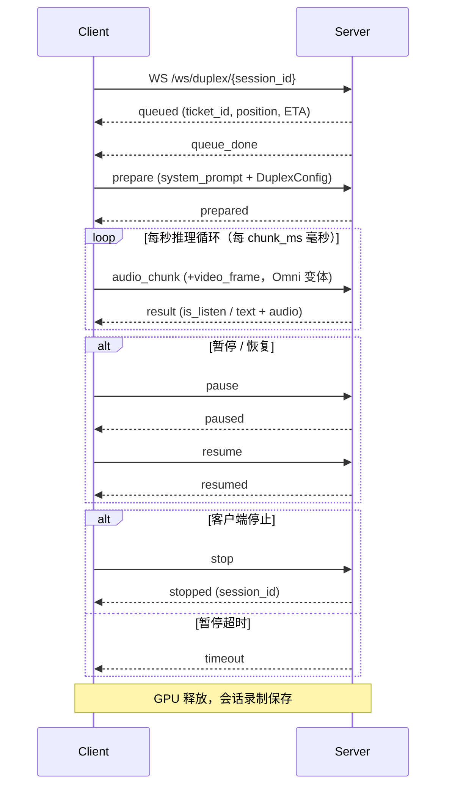

# Duplex 模式（全双工）

### 概述

Duplex 模式实现同时输入输出——用户可以一边说话（可选同时展示视频），模型一边生成音频回复。系统运行**每秒一轮的推理循环**：每秒将用户音频（以及可选的视频帧）送入模型，模型自主决定是**监听**（保持沉默，继续吸收输入）还是**说话**（生成文本 + 音频输出）。

两个变体共享同一 WebSocket 端点，区别仅在于输入模态：

| 变体 | 输入 | 每秒客户端发送内容 |
|------|------|------------------|
| **Omnimodal 全双工** | 语音 + 摄像头 | `audio_chunk` + `video_frame` |
| **Audio 全双工** | 仅语音 | 仅 `audio_chunk` |

GPU Worker 在整个会话期间被独占。与 Half-Duplex 不同，没有显式的 VAD——模型自身基于音频内容和习得的监听/说话概率来决定何时说话。

**能力**：语音（+ 视觉）输入 → 文本 + 语音输出，自主监听/说话决策，打断支持，暂停/恢复，独占 GPU Worker。

### 生命周期



**阶段 1 — 连接与排队**：客户端连接 `wss://host/ws/duplex/{session_id}`，使用唯一的 session ID。session ID 前缀决定变体：`omni_*` 为 Omnimodal，`audio_duplex_*` 为纯音频。服务端将请求入队并发送 `queued`，包含 `ticket_id`、`position` 和 `eta_seconds`。等待期间客户端可能收到 `queue_update` 消息。分配到 Worker 后收到 `queue_done`。

**阶段 2 — 准备**：客户端发送 `prepare`，包含系统提示、DuplexConfig 参数，以及可选的参考音频路径。服务端初始化全双工会话：加载 TTS、prefill 系统提示、设置内部状态。客户端收到 `prepared`。此时应开始音频采集。

**阶段 3 — 每秒推理循环**：Duplex 模式的核心。每 `chunk_ms` 毫秒（默认 1000ms），客户端发送一个 `audio_chunk`（Omni 变体同时发送 `video_frame`）。服务端对每个 chunk 执行三步流水线：

1. **Prefill**：音频波形（和视频帧）被编码并追加到 KV Cache。
2. **Generate**：模型进行一步生成。输出**监听**决策（保持沉默，继续吸收输入）或**说话**决策（发出文本 token + 音频）。
3. **Finalize**：生成后的内务处理（更新轮次状态，处理 end-of-turn）。

客户端每步收到一条 `result` 消息。

**启动保护（`force_listen_count`）**：前 N 步（默认 3），模型被强制处于监听状态，无论其内部判断如何。这防止模型在获得足够上下文之前就开始说话。

**监听/说话行为**：当 `result.is_listen` 为 `true` 时，模型听到了音频但选择保持沉默——`text` 和 `audio_data` 为空。当 `is_listen` 为 `false` 时，模型正在说话——`text` 包含生成的 token，`audio_data` 包含对应音频。多个连续的 `is_listen: false` 结果构成一个连续的说话轮次。当 `end_of_turn` 变为 `true` 时，模型完成了当前说话轮次并转回监听。

**打断（`set_break`）**：如果客户端检测到用户在模型说话过程中开始说话（基于输入音频能量或客户端侧 VAD），可以继续发送 `audio_chunk`。模型可能在下一步自然地从说话转回监听——这就是"打断"行为。

**阶段 4 — 暂停 / 恢复**：客户端可发送 `pause` 临时挂起会话（如用户切换标签页）。服务端回复 `paused`。暂停期间不应发送 `audio_chunk`。要恢复，发送 `resume`；服务端回复 `resumed`。如果暂停时间超过 `pause_timeout`（默认 60 秒），服务端发送 `timeout` 并自动释放 GPU。

**阶段 5 — 终止**：会话在以下情况结束：
- **客户端停止**：客户端发送 `stop`。服务端回复 `stopped`，包含 `session_id`。
- **暂停超时**：暂停超时后服务端发送 `timeout`。
- **连接中断**：WebSocket 意外断开时，服务端自动清理会话。

终止后，GPU 显存被释放，会话录制被保存。

### WebSocket — wss://host/ws/duplex/{session_id}

#### 客户端 → 服务端

| 消息类型 | 关键字段 | 何时发送 | 说明 |
|---------|---------|---------|------|
| `prepare` | `prefix_system_prompt`, `config`, `ref_audio_path` | `queue_done` 后发一次 | 使用系统提示和配置初始化全双工会话 |
| `audio_chunk` | `audio` (Base64) | `prepared` 后每 `chunk_ms` ms | 发送一段麦克风音频（PCM float32, 16kHz）。chunk 时长应与 `config.chunk_ms` 匹配（默认 1s） |
| `video_frame` | `frame` (Base64 JPEG) | 随每个 `audio_chunk` 一起（仅 Omni） | 发送一帧摄像头画面。仅 Omnimodal 变体使用 |
| `pause` | — | 活跃会话期间任意时刻 | 临时挂起会话。停止发送 `audio_chunk` |
| `resume` | — | 收到 `paused` 后 | 恢复已暂停的会话。重新开始发送 `audio_chunk` |
| `stop` | — | 任意时刻 | 优雅停止会话并释放 GPU |
| `client_diagnostic` | `metrics` | 定期（可选） | 客户端诊断指标，用于监控 |

**`prepare` 示例**：

```json
{
  "type": "prepare",
  "prefix_system_prompt": "你是一个有趣的助手。",
  "config": {
    "generate_audio": true,
    "chunk_ms": 1000,
    "temperature": 0.7,
    "top_p": 0.8,
    "top_k": 20,
    "force_listen_count": 3,
    "max_new_speak_tokens_per_chunk": 20,
    "listen_prob_scale": 1.0,
    "ls_mode": "explicit",
    "sample_rate": 16000
  },
  "ref_audio_path": "assets/ref_audio/ref_minicpm_signature.wav"
}
```

**DuplexConfig 字段**：

| 字段 | 类型 | 默认值 | 说明 |
|------|------|--------|------|
| `generate_audio` | bool | true | 生成音频输出。设为 false 时仅产生文本 |
| `ls_mode` | string | `"explicit"` | Listen/Speak 决策模式。控制模型如何在监听和说话之间做决策 |
| `force_listen_count` | int | 3 | 启动保护：前 N 步强制模型处于监听状态，防止在建立足够上下文之前过早说话 |
| `max_new_speak_tokens_per_chunk` | int | 20 | 每步最大 speak token 数。限制每秒生成的文本量以维持实时节奏 |
| `temperature` | float | 0.7 | 文本生成的采样温度 |
| `top_k` | int | 20 | Top-K 采样 |
| `top_p` | float | 0.8 | Top-P（核）采样 |
| `listen_prob_scale` | float | 1.0 | 监听概率缩放因子。值 > 1.0 使模型更倾向监听（更沉默）；< 1.0 使其更积极说话 |
| `chunk_ms` | int | 1000 | 音频块时长（毫秒）。决定每秒推理循环的节奏。客户端必须按此间隔发送音频块 |
| `sample_rate` | int | 16000 | 预期音频采样率 |

**`audio_chunk` 示例**：
```json
{
  "type": "audio_chunk",
  "audio": "<base64 PCM float32, 16kHz, 1s>"
}
```

**`video_frame` 示例**：
```json
{
  "type": "video_frame",
  "frame": "<base64 JPEG>"
}
```

#### 服务端 → 客户端

消息按生命周期顺序到达。活跃循环期间，`result` 消息以 `chunk_ms` 的节奏到达。

| 消息类型 | 关键字段 | 生命周期阶段 | 说明 |
|---------|---------|------------|------|
| `queued` | `ticket_id`, `position`, `eta_seconds` | 连接 | 已入队，等待 GPU |
| `queue_update` | `position`, `eta_seconds` | 连接 | 队列位置变化 |
| `queue_done` | — | 连接 | GPU 已分配。客户端应发送 `prepare` |
| `prepared` | — | 准备 | 会话就绪。客户端应开始发送 `audio_chunk` |
| `result` | `is_listen`, `text`, `audio_data`, `end_of_turn`, 时间字段 | 活跃循环 | 每步推理结果。详见下方 DuplexGenerateResult |
| `paused` | — | 暂停 | 会话已暂停 |
| `resumed` | — | 恢复 | 会话已恢复 |
| `stopped` | `session_id` | 终止 | 会话已停止，GPU 已释放 |
| `timeout` | — | 终止 | 暂停超时，GPU 已释放 |
| `error` | `message` | 任意 | 错误；连接将关闭 |

**DuplexGenerateResult 字段**（`result` 消息载荷）：

| 字段 | 类型 | 说明 |
|------|------|------|
| `is_listen` | bool | `true` = 模型选择监听（沉默）。`false` = 模型选择说话（正在生成输出） |
| `text` | string | 生成的文本 token。`is_listen: true` 时为空字符串 |
| `audio_data` | string | 24kHz Base64 音频。`is_listen: true` 时为空字符串。客户端应立即播放此音频 |
| `end_of_turn` | bool | 当模型完成说话轮次并转回监听时为 `true`。仅在 `is_listen: false` 时有意义 |
| `current_time` | int | 会话累计时间（毫秒） |
| `cost_llm_ms` | float | 本步 LLM 推理延迟（ms） |
| `cost_tts_ms` | float | 本步 TTS 合成延迟（ms） |
| `cost_all_ms` | float | 本步总延迟，含 prefill + generate + finalize（ms）。应保持低于 `chunk_ms` 以维持实时性能 |
| `n_tokens` | int | 本步生成的 LLM token 数 |
| `n_tts_tokens` | int | 本步生成的 TTS token 数 |
| `server_send_ts` | float | 服务端发送时间戳（unix 秒）。用于客户端延迟测量 |

**`result` 示例（说话中）**：
```json
{
  "type": "result",
  "is_listen": false,
  "text": "你好",
  "audio_data": "<base64, 24kHz>",
  "end_of_turn": false,
  "current_time": 5000,
  "cost_llm_ms": 45.2,
  "cost_tts_ms": 12.3,
  "cost_all_ms": 78.5,
  "n_tokens": 3,
  "server_send_ts": 1708771200.123
}
```

**`result` 示例（监听中）**：
```json
{
  "type": "result",
  "is_listen": true,
  "text": "",
  "audio_data": "",
  "end_of_turn": false,
  "current_time": 3000,
  "cost_llm_ms": 12.1,
  "cost_tts_ms": 0,
  "cost_all_ms": 35.4,
  "n_tokens": 1,
  "server_send_ts": 1708771197.456
}
```

### 示例：完整生命周期

**JavaScript — Audio Duplex**

```javascript
const sessionId = 'adx_' + Date.now().toString(36);
const ws = new WebSocket(`wss://${location.host}/ws/duplex/${sessionId}`);
let currentText = '';

// -- 声音克隆参考音频 (base64 PCM float32, 16kHz) --
const refAudioBase64 = getRefAudioBase64();

ws.onopen = () => console.log('已连接，等待排队...');

ws.onmessage = (event) => {
  const msg = JSON.parse(event.data);
  switch (msg.type) {
    case 'queued':
      console.log(`排队 #${msg.position}，预计等待: ${msg.eta_seconds}s`);
      break;
    case 'queue_update':
      console.log(`队列更新至 #${msg.position}`);
      break;

    case 'queue_done':
      // GPU 已分配——发送 prepare，附带参考音频用于声音克隆。
      // ref_audio_base64 同时用于 LLM 系统提示嵌入和 TTS 声音。
      // 如需使用不同的 TTS 声音，可单独设置 tts_ref_audio_base64。
      ws.send(JSON.stringify({
        type: 'prepare',
        prefix_system_prompt: '你是一个有趣的助手。',
        ref_audio_base64: refAudioBase64,
        config: {
          generate_audio: true,
          chunk_ms: 1000,
          temperature: 0.7,
          force_listen_count: 3,
        },
      }));
      break;

    case 'prepared':
      console.log('会话就绪，开始音频采集');
      startPerSecondCapture();
      break;

    case 'result':
      // 每秒推理结果：模型决定监听或说话
      if (msg.is_listen) {
        console.log(`[${msg.current_time}ms] 监听中 (${msg.cost_all_ms.toFixed(0)}ms)`);
      } else {
        currentText += msg.text;
        console.log(`[${msg.current_time}ms] 说话中: "${msg.text}" (${msg.cost_all_ms.toFixed(0)}ms)`);
        if (msg.audio_data) playAudio(msg.audio_data);  // PCM float32, 24kHz
        if (msg.end_of_turn) {
          console.log(`轮次结束，完整文本: "${currentText}"`);
          currentText = '';
        }
      }
      break;

    case 'paused':
      console.log('会话已暂停');
      break;
    case 'resumed':
      console.log('会话已恢复');
      break;
    case 'stopped':
      console.log(`会话已停止: ${msg.session_id}`);
      break;
    case 'timeout':
      console.log('暂停超时——会话结束');
      break;
    case 'error':
      console.error('错误:', msg.message);
      break;
  }
};

async function startPerSecondCapture() {
  const stream = await navigator.mediaDevices.getUserMedia({ audio: { sampleRate: 16000 } });
  const ctx = new AudioContext({ sampleRate: 16000 });
  await ctx.audioWorklet.addModule('capture-processor.js');
  const source = ctx.createMediaStreamSource(stream);
  const node = new AudioWorkletNode(ctx, 'capture-processor', {
    processorOptions: { chunkSize: 16000 }  // 16kHz 采样率下 1 秒的音频
  });
  source.connect(node);

  // AudioWorklet 是事件驱动的，不是定时器：
  // 音频渲染线程实时累积麦克风采样，每积满 1 秒数据时自动触发 'chunk'。
  // 无需 sleep 或 setInterval。
  node.port.onmessage = (e) => {
    if (e.data.type === 'chunk' && ws.readyState === WebSocket.OPEN) {
      const msg = {
        type: 'audio_chunk',
        audio: arrayBufferToBase64(e.data.audio.buffer),
      };
      // Omni 变体额外附加视频帧：
      // msg.frame_base64_list = [captureFrameAsJpegBase64()];
      ws.send(JSON.stringify(msg));
    }
  };
}

function pauseSession()  { ws.send(JSON.stringify({ type: 'pause' })); }
function resumeSession() { ws.send(JSON.stringify({ type: 'resume' })); }
function stopSession()   { ws.send(JSON.stringify({ type: 'stop' })); }
```

**Python**

```python
import asyncio, json, base64, time
import numpy as np
import websockets

def load_ref_audio(path: str) -> str:
    """加载 WAV 文件，返回 base64 编码的 PCM float32 (16kHz)。"""
    import soundfile as sf
    audio, _ = sf.read(path, dtype="float32", samplerate=16000)
    return base64.b64encode(audio.tobytes()).decode()

def audio_file_to_1s_chunks(path, sr=16000):
    """读取音频文件，按 1 秒切分为 float32 块并 base64 编码。"""
    import soundfile as sf
    audio, _ = sf.read(path, dtype="float32", samplerate=sr)
    for i in range(0, len(audio), sr):
        yield base64.b64encode(audio[i:i + sr].tobytes()).decode()

async def duplex_session(
    audio_path: str,
    server="wss://localhost:8006",
    ref_audio_path: str | None = "ref.wav",
):
    session_id = f"adx_{int(time.time()*1000):x}"
    url = f"{server}/ws/duplex/{session_id}"

    async with websockets.connect(url) as ws:
        # 1. 等待排队分配
        while True:
            msg = json.loads(await ws.recv())
            if msg["type"] == "queue_done":
                break

        # 2. 发送 prepare — 附带参考音频用于声音克隆。
        #    ref_audio_base64 同时用于 LLM 系统提示嵌入和 TTS 声音。
        #    如需使用不同的 TTS 声音，可单独设置 tts_ref_audio_base64。
        prepare_msg = {
            "type": "prepare",
            "prefix_system_prompt": "你是一个有趣的助手。",
            "config": {
                "generate_audio": True,
                "chunk_ms": 1000,
                "temperature": 0.7,
                "force_listen_count": 3,
            },
        }
        if ref_audio_path:
            prepare_msg["ref_audio_base64"] = load_ref_audio(ref_audio_path)
        await ws.send(json.dumps(prepare_msg))

        msg = json.loads(await ws.recv())
        assert msg["type"] == "prepared"
        print("会话就绪")

        # 3. 并发发送音频和接收结果
        async def send_audio():
            for chunk_b64 in audio_file_to_1s_chunks(audio_path):
                await ws.send(json.dumps({
                    "type": "audio_chunk",
                    "audio": chunk_b64,
                }))
                # 模拟实时麦克风节奏：浏览器端 AudioWorklet 由音频渲染线程
                # 实时驱动，每积满 1 秒数据时自动触发——无需 sleep。
                # 这里从文件读取，需要 sleep 来匹配服务端的每秒推理循环。
                await asyncio.sleep(1.0)
            # 等待服务端处理完最后的 chunk
            await asyncio.sleep(3)
            await ws.send(json.dumps({"type": "stop"}))

        async def recv_results():
            current_text = ""
            async for raw in ws:
                msg = json.loads(raw)
                if msg["type"] == "result":
                    t = msg["current_time"]
                    if msg["is_listen"]:
                        print(f"[{t}ms] 监听中 ({msg['cost_all_ms']:.0f}ms)")
                    else:
                        current_text += msg.get("text", "")
                        print(f"[{t}ms] 说话中: {msg.get('text', '')!r} ({msg['cost_all_ms']:.0f}ms)")
                        if msg["end_of_turn"]:
                            print(f"  轮次结束: {current_text!r}")
                            current_text = ""
                elif msg["type"] in ("stopped", "timeout"):
                    print(f"会话结束: {msg['type']}")
                    break

        await asyncio.gather(send_audio(), recv_results())

asyncio.run(duplex_session("test_audio.wav"))
```

### Processor 方法链

Duplex 会话中每一秒的内部处理流水线：

| 阶段 | 方法 | 说明 |
|------|------|------|
| 初始化 | `UnifiedProcessor.set_duplex_mode()` | 切换到 Duplex 模式（< 0.1ms），返回 `DuplexView` |
| 准备 | `DuplexView.prepare(system_prompt, ref_audio_path, prompt_wav_path)` | 初始化会话：prefill 系统提示，加载 TTS 参考音频 |
| 每步 | `DuplexView.prefill(audio_waveform, frame_list, ...)` | 编码并追加 1 秒音频（+ 视频帧）到 KV Cache |
| 每步 | `DuplexView.generate(force_listen)` | 执行一步生成。返回 `DuplexGenerateResult`，包含监听/说话决策、文本、音频和耗时 |
| 每步 | `DuplexView.finalize()` | 生成后的内务处理：更新轮次计数器，处理 end_of_turn 的延迟终结 |
| 打断 | `DuplexView.set_break()` / `clear_break()` | 设置或清除打断标志。设置后模型在下一步将转为监听 |
| 终止 | `DuplexView.stop()` | 通知会话停止 |
| 清理 | `DuplexView.cleanup()` | 释放 GPU 显存，清空 KV Cache，终结会话状态 |

