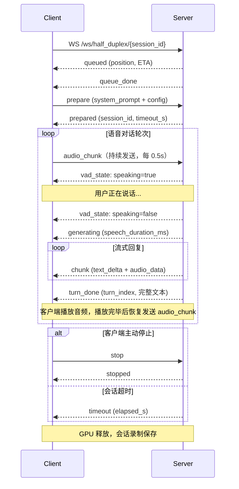

# Half-Duplex 模式（VAD 半双工语音对话）

### 概述

Half-Duplex 模式实现免提式的自动轮流语音对话。服务端运行 **SileroVAD**（语音活动检测）来自动检测用户何时开始说话、何时说完。用户说完后，模型流式生成回复。播放完毕后系统恢复监听——类似电话式的轮流对话。

与 Chat 模式不同，Half-Duplex 是**有状态的长时会话**。GPU Worker 在整个会话期间被独占（默认 3 分钟超时）。KV Cache 在多轮对话间持续积累，模型可以利用完整的对话历史上下文，无需重新编码之前的轮次。

**能力**：语音输入 → 文本 + 语音输出，流式输出，多轮上下文积累，KV Cache 持久化，独占 GPU Worker。

### 生命周期



**阶段 1 — 连接与排队**：客户端连接 `wss://host/ws/half_duplex/{session_id}`，使用唯一的 session ID。服务端将请求放入 FIFO 队列。客户端收到 `queued`，包含排队位置和预计等待时间。当 GPU Worker 可用时，客户端收到 `queue_done`。

**阶段 2 — 准备**：客户端发送 `prepare`，包含系统提示、VAD 参数、生成配置、TTS 设置，以及可选的参考音频用于语音克隆。服务端执行初始化：(1) 加载 SileroVAD ONNX 模型，(2) 将系统提示 prefill 到 KV Cache，(3) 使用参考音频初始化 TTS，(4) 启动会话录制器。客户端收到 `prepared`，包含分配的 `session_id`、`timeout_s` 和 `recording_session_id`。

**阶段 3 — 监听循环**：客户端开始持续发送 `audio_chunk` 消息（每 0.5 秒一次，float32 PCM 16kHz）。服务端将每个 chunk 送入 StreamingVAD。当检测到语音时，服务端发送 `vad_state: {speaking: true}`。客户端应显示"正在听"的指示。

**冷启动保护**：`prepared` 后的前 0.5 秒，所有 VAD 结果被忽略，以过滤麦克风初始化噪音。

**阶段 4 — 语音结束与生成**：当 VAD 检测到持续静音（可通过 `min_silence_duration_ms` 配置，默认 800ms），累积的语音片段被定型。服务端先发送 `vad_state: {speaking: false}`，紧接着发送 `generating`（包含 `speech_duration_ms`）。语音片段被编码为音频内容并 prefill 到 KV Cache，然后开始流式生成。每个生成的 token 产生一条 `chunk` 消息，包含 `text_delta` 和 `audio_data`。

**阶段 5 — 轮次完成**：生成结束时，服务端发送 `turn_done`，包含 `turn_index`（从 0 开始的计数器）和本轮完整 `text`。客户端应播放所有已接收的音频。播放期间，客户端**必须停止发送 `audio_chunk`**，以防止回声反馈（否则模型会听到自己的声音）。播放完毕后，客户端等待额外约 800ms 缓冲，然后恢复发送 `audio_chunk` 开始下一轮。

**阶段 6 — 终止**：会话以三种方式之一结束：
- **客户端停止**：客户端发送 `stop`。服务端发送 `stopped` 并释放 GPU。
- **超时**：如果 `timeout_s` 秒内（默认 180）未收到 `audio_chunk`，服务端发送 `timeout`（包含 `elapsed_s`）并释放 GPU。
- **外部停止**：通过 HTTP `POST /api/half_duplex/stop` 携带 `session_id` 可强制中断正在进行的生成。

终止后，会话录制被保存，可用于回放。

### WebSocket — wss://host/ws/half_duplex/{session_id}

#### 客户端 → 服务端

| 消息类型 | 关键字段 | 说明 |
|---------|---------|------|
| `prepare` | `system_prompt`, `config`, `ref_audio_base64`, `system_content` | 初始化会话；必须在 `queue_done` 后发送的第一条消息 |
| `audio_chunk` | `audio_base64` | 发送麦克风音频（float32 PCM 16kHz，每次约 0.5s）。监听阶段必须持续发送。AI 音频播放期间**必须停止发送**以防回声 |
| `stop` | — | 优雅停止会话并释放 GPU |

**`prepare` 示例**：

```json
{
  "type": "prepare",
  "system_prompt": "You are a helpful assistant.",
  "config": {
    "vad": {
      "threshold": 0.8,
      "min_speech_duration_ms": 128,
      "min_silence_duration_ms": 800,
      "speech_pad_ms": 30
    },
    "generation": {
      "max_new_tokens": 256,
      "length_penalty": 1.1,
      "temperature": 0.7
    },
    "tts": {
      "enabled": true
    },
    "session": {
      "timeout_s": 180
    }
  },
  "ref_audio_base64": "<base64 参考音频>"
}
```

**`config` 字段**：

| 分类 | 字段 | 默认值 | 说明 |
|------|------|--------|------|
| `vad` | `threshold` | 0.8 | 语音概率阈值。SileroVAD 以 1024 样本为窗口滑动检测，输出每个窗口的语音概率。概率 >= 阈值标记为"开始说话"。值越高误触越少，但可能错过轻声说话 |
| `vad` | `min_speech_duration_ms` | 128 | 有效语音的最短时长。短于此值的片段被作为噪音丢弃 |
| `vad` | `min_silence_duration_ms` | 800 | 确认说完所需的持续静音时长。值越小轮次切换越快，但可能在句中停顿时误判为说完 |
| `vad` | `speech_pad_ms` | 30 | 语音片段两侧的填充时长，避免裁切词语边界 |
| `generation` | `max_new_tokens` | 256 | 每轮最大生成 token 数 |
| `generation` | `length_penalty` | 1.1 | 长度惩罚系数（> 1.0 鼓励更长回复） |
| `generation` | `temperature` | 0.7 | 采样温度 |
| `tts` | `enabled` | true | 启用语音回复。设为 false 时仅生成文本 |
| `session` | `timeout_s` | 180 | 会话超时时间（秒）。每次收到 `audio_chunk` 时计时器重置 |

**`audio_chunk` 示例**：
```json
{
  "type": "audio_chunk",
  "audio_base64": "<base64 PCM float32, 16kHz, ~0.5s>"
}
```

#### 服务端 → 客户端

消息在每轮内按严格的生命周期顺序到达：

| 消息类型 | 关键字段 | 生命周期阶段 | 说明 |
|---------|---------|------------|------|
| `queued` | `position`, `estimated_wait_s` | 连接 | 请求已入队 |
| `queue_done` | — | 连接 | 已出队，GPU Worker 已分配。客户端应发送 `prepare` |
| `prepared` | `session_id`, `timeout_s`, `recording_session_id` | 准备 | 会话已初始化。系统提示已 prefill，VAD 就绪，TTS 已加载。客户端应开始发送 `audio_chunk` |
| `vad_state` | `speaking` (bool) | 监听 | VAD 状态转换。`true` = 检测到语音（用户开始说话）。`false` = 语音结束（用户停止说话） |
| `generating` | `speech_duration_ms` | 轮次开始 | 服务端正在处理语音片段并启动生成 |
| `chunk` | `text_delta`, `audio_data` | 生成中 | 一个流式 chunk。`text_delta` 为增量文本；`audio_data` 为对应的 24kHz 音频段。客户端应按顺序缓冲并播放音频 |
| `turn_done` | `turn_index`, `text` | 轮次结束 | 本轮生成完成。`text` 为本轮完整回复文本。客户端应播放完缓冲音频，然后延迟约 800ms 后恢复发送 `audio_chunk` |
| `timeout` | `elapsed_s` | 终止 | 会话因无活动超时。连接将关闭 |
| `error` | `error` | 任意 | 发生错误。连接将关闭 |

**`turn_done` 示例**：
```json
{
  "type": "turn_done",
  "turn_index": 2,
  "text": "好的，我可以帮你解答这个问题。"
}
```

### REST — POST /api/half_duplex/stop

从 WebSocket 连接外部强制停止正在进行的半双工生成。适用于在 UI 中实现独立于音频流的"停止"按钮。

**请求体**：
```json
{"session_id": "stream_abc123"}
```

### 示例：完整生命周期

**JavaScript**

```javascript
const sessionId = 'hdx_' + Math.random().toString(36).slice(2, 10);
const ws = new WebSocket(`wss://${location.host}/ws/half_duplex/${sessionId}`);
let aiSpeaking = false;
let audioContext, captureNode;

// -- 声音克隆参考音频 (base64 PCM float32, 16kHz) --
const refAudioBase64 = getRefAudioBase64();

ws.onopen = () => console.log('已连接，等待排队...');

ws.onmessage = (event) => {
  const msg = JSON.parse(event.data);
  switch (msg.type) {
    case 'queued':
      console.log(`排队位置: #${msg.position}，预计等待: ${msg.estimated_wait_s}s`);
      break;

    case 'queue_done':
      // GPU 已分配——发送 prepare，通过 system_content 嵌入参考音频。
      // system_content 遵循模型最佳实践格式：[text, audio, text]。
      // 其中的 audio 项用于 LLM 上下文嵌入和 TTS 声音克隆。
      ws.send(JSON.stringify({
        type: 'prepare',
        system_content: [
          { type: 'text', text: '模仿音频样本的音色并生成新的内容。' },
          { type: 'audio', data: refAudioBase64 },         // 参考音色
          { type: 'text', text: '你是一个有帮助的助手，请自然地回复。' },
        ],
        config: {
          vad: { threshold: 0.8, min_silence_duration_ms: 800 },
          generation: { max_new_tokens: 256, temperature: 0.7 },
          tts: { enabled: true },
          session: { timeout_s: 180 },
        },
      }));
      break;

    case 'prepared':
      console.log(`会话就绪（超时: ${msg.timeout_s}s）`);
      startMicCapture();  // 开始发送 audio_chunk
      break;

    case 'vad_state':
      // 服务端 VAD 检测到语音开始/结束
      console.log(msg.speaking ? '用户正在说话...' : '用户停止说话');
      break;

    case 'generating':
      // 服务端正在处理用户语音并开始生成回复，
      // 此时暂停发送麦克风音频以防止回声反馈。
      aiSpeaking = true;
      console.log(`开始生成（语音时长: ${msg.speech_duration_ms}ms）`);
      break;

    case 'chunk':
      // 流式 token：增量文本和/或音频片段
      if (msg.text_delta) process.stdout.write(msg.text_delta);
      if (msg.audio_data) playAudio(msg.audio_data);  // PCM float32, 24kHz
      break;

    case 'turn_done':
      // 本轮完成 — 等播放完毕 + 800ms 缓冲后恢复麦克风，
      // 避免采集到 AI 自身的音频输出。
      console.log(`\n轮次 ${msg.turn_index} 完成: ${msg.text}`);
      setTimeout(() => { aiSpeaking = false; }, getPlaybackRemaining() + 800);
      break;

    case 'timeout':
      console.log(`会话超时（${msg.elapsed_s}s）`);
      break;
    case 'error':
      console.error('错误:', msg.error);
      break;
  }
};

async function startMicCapture() {
  const stream = await navigator.mediaDevices.getUserMedia({ audio: { sampleRate: 16000 } });
  audioContext = new AudioContext({ sampleRate: 16000 });
  await audioContext.audioWorklet.addModule('capture-processor.js');
  const source = audioContext.createMediaStreamSource(stream);
  captureNode = new AudioWorkletNode(audioContext, 'capture-processor');
  source.connect(captureNode);

  // AudioWorklet 是事件驱动的，不是定时器：
  // 音频渲染线程实时累积麦克风采样，缓冲区满约 0.5 秒时自动触发 'chunk'。
  // 无需 sleep 或轮询。
  captureNode.port.onmessage = (e) => {
    if (e.data.type === 'chunk' && !aiSpeaking && ws.readyState === WebSocket.OPEN) {
      ws.send(JSON.stringify({
        type: 'audio_chunk',
        audio_base64: float32ToBase64(e.data.audio),
      }));
    }
  };
}

function stopSession() {
  ws.send(JSON.stringify({ type: 'stop' }));
  ws.close();
}
```

**Python**

```python
import asyncio, json, base64
import numpy as np
import websockets

def load_ref_audio(path: str) -> str:
    """加载 WAV 文件，返回 base64 编码的 PCM float32 (16kHz)。"""
    import soundfile as sf
    audio, _ = sf.read(path, dtype="float32", samplerate=16000)
    return base64.b64encode(audio.tobytes()).decode()

def audio_file_to_chunks(path, chunk_duration=0.5, sr=16000):
    """读取音频文件，切分为 0.5 秒的 float32 块并返回 base64。"""
    import soundfile as sf
    audio, _ = sf.read(path, dtype="float32", samplerate=sr)
    chunk_size = int(sr * chunk_duration)
    for i in range(0, len(audio), chunk_size):
        yield base64.b64encode(audio[i:i + chunk_size].tobytes()).decode()

async def half_duplex_session(
    audio_path: str,
    server="wss://localhost:8006",
    ref_audio_path: str | None = "ref.wav",
):
    session_id = f"hdx_{id(object()):x}"
    url = f"{server}/ws/half_duplex/{session_id}"

    async with websockets.connect(url) as ws:
        # 1. 等待排队分配
        while True:
            msg = json.loads(await ws.recv())
            if msg["type"] == "queue_done":
                break
            print(f"排队中 #{msg.get('position')}")

        # 2. 发送 prepare — system_content 嵌入参考音频用于声音克隆。
        #    格式遵循模型最佳实践：[text, audio, text]。
        ref_b64 = load_ref_audio(ref_audio_path) if ref_audio_path else None
        system_content = [
            {"type": "text", "text": "模仿音频样本的音色并生成新的内容。"},
            {"type": "audio", "data": ref_b64},         # 参考音色
            {"type": "text", "text": "你是一个有帮助的助手，请自然地回复。"},
        ] if ref_b64 else None

        prepare_msg = {
            "type": "prepare",
            "config": {
                "vad": {"threshold": 0.8, "min_silence_duration_ms": 800},
                "generation": {"max_new_tokens": 256, "temperature": 0.7},
                "tts": {"enabled": True},
                "session": {"timeout_s": 60},
            },
        }
        if system_content:
            prepare_msg["system_content"] = system_content
        await ws.send(json.dumps(prepare_msg))

        msg = json.loads(await ws.recv())
        assert msg["type"] == "prepared"
        print(f"会话就绪: {msg['session_id']}")

        # 3. 并发发送音频和接收消息
        async def send_audio():
            for chunk_b64 in audio_file_to_chunks(audio_path):
                await ws.send(json.dumps({
                    "type": "audio_chunk",
                    "audio_base64": chunk_b64,
                }))
                # 模拟实时麦克风节奏：浏览器端 AudioWorklet 由音频渲染线程
                # 实时驱动，缓冲区满时自动触发——无需 sleep。
                # 这里从文件读取，需要 sleep 来匹配实时节奏。
                await asyncio.sleep(0.5)
            # 等待服务端完成最后一轮生成
            await asyncio.sleep(5)
            await ws.send(json.dumps({"type": "stop"}))

        async def recv_messages():
            async for raw in ws:
                msg = json.loads(raw)
                if msg["type"] == "vad_state":
                    print("正在说话..." if msg["speaking"] else "停止说话")
                elif msg["type"] == "generating":
                    print(f"开始生成（语音时长 {msg['speech_duration_ms']}ms）")
                elif msg["type"] == "chunk":
                    if msg.get("text_delta"):
                        print(msg["text_delta"], end="", flush=True)
                elif msg["type"] == "turn_done":
                    print(f"\n--- 轮次 {msg['turn_index']} 完成 ---")
                elif msg["type"] in ("stopped", "timeout"):
                    break

        await asyncio.gather(send_audio(), recv_messages())

asyncio.run(half_duplex_session("test_audio.wav"))
```

### Processor 方法链

Half-Duplex 会话的内部处理流水线：

| 阶段 | 方法 | 说明 |
|------|------|------|
| 初始化 | `UnifiedProcessor.set_half_duplex_mode()` | 切换到 Half-Duplex 模式（< 0.1ms），返回 `HalfDuplexView` |
| 初始化 | `HalfDuplexView.init_ref_audio(path)` 或 `init_ref_audio_from_data(ndarray)` | 加载参考音频用于 TTS 语音克隆 |
| 准备 | `HalfDuplexView.prefill(request)` | 将系统提示 prefill 到 KV Cache；创建回滚快照 |
| 每轮 | `HalfDuplexView.prefill(request)` | 将用户语音片段 prefill 到 KV Cache |
| 每轮 | `HalfDuplexView.generate(session_id, ...)` | 流式生成，yield `StreamingChunk`（文本 + 音频） |
| 恢复 | `HalfDuplexView.can_rollback()` → `rollback()` | 检查是否可回滚，然后恢复 KV Cache 到上一快照（如生成出错时） |
| 恢复 | `HalfDuplexView.clear_rollback_point()` | 成功完成一轮后丢弃快照 |

