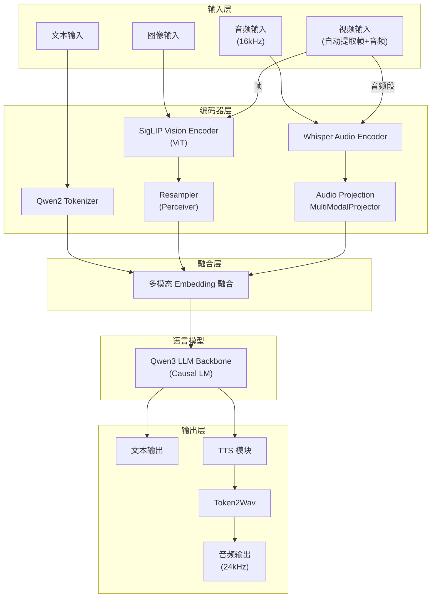

# MiniCPMO45 模型模块详解

MiniCPMO45 是系统的核心模型模块，实现了多模态大语言模型的推理能力，支持文本、图像、音频、视频输入和文本、音频输出。

## 模块结构

```
MiniCPMO45/
├── configuration_minicpmo.py       # 模型配置定义
├── modeling_minicpmo.py            # 主模型实现
├── modeling_minicpmo_unified.py    # 统一模型（支持热切换）
├── modeling_navit_siglip.py        # SigLIP 视觉编码器
├── processing_minicpmo.py          # 多模态处理器
├── tokenization_minicpmo_fast.py   # 快速分词器
├── utils.py                        # 工具函数
├── tokenizer_config.json           # 分词器配置
├── generation_config.json          # 生成配置
├── preprocessor_config.json        # 预处理器配置
├── special_tokens_map.json         # 特殊 token 映射
└── added_tokens.json               # 扩展 token
```

## 多模态架构总览



---

## 核心模型结构

`MiniCPMO` 是整个系统的核心类（继承自 `Qwen3PreTrainedModel`），内部组合了 6 个子模块，各负责一个模态或功能：

- **`llm`** — `Qwen3ForCausalLM`，语言模型主干，负责多模态融合后的因果推理与文本生成。
- **`vpm`** — `SiglipVisionTransformer`，视觉编码器，将图像 patch 编码为视觉特征序列。
- **`resampler`** — `Resampler`（Perceiver 式交叉注意力），将可变长度的视觉特征压缩为固定数量的查询向量。
- **`apm`** — `MiniCPMWhisperEncoder`，音频编码器（基于 Whisper），将梅尔频谱编码为音频特征。
- **`audio_projection_layer`** — `MultiModalProjector`（Linear → ReLU → Linear），将音频特征映射到 LLM 的嵌入空间。
- **`tts`** — `MiniCPMTTS`，语音合成模块，将 LLM 的隐状态转化为音频 token。

各子模块可通过配置项 `init_vision` / `init_audio` / `init_tts` 独立启用或禁用。

### 统一模型与模式切换

`modeling_minicpmo_unified.py` 中的 `MiniCPMO` 在上述基础上增加了**统一模式管理**，通过 `ProcessorMode` 枚举在三种模式间热切换：

- **`CHAT`** — 标准多模态对话，支持图像/音频/视频输入，文本或语音输出。
- **`STREAMING`** — 流式对话，支持逐块输入与流式输出。
- **`DUPLEX`** — 全双工实时对话，同时进行听与说。

切换通过 `set_mode(mode)` 完成，仅重置会话状态（KV Cache、Token2Wav 缓存等），不重新加载模型权重，因此切换开销极低。

---

## 输入编码

### 文本编码

文本输入经 Qwen2 Tokenizer 分词后，通过 `llm.model.embed_tokens` 转换为嵌入向量。嵌入后会乘以可选的 `scale_emb` 缩放因子。

### 视觉编码（图像与视频）

图像处理分三步：

1. **图像切片**（`MiniCPMVImageProcessor`）— 大图按 `MiniCPMVSliceConfig` 配置切分为多个 patch（最多 `max_slice_nums=9` 块，每块 `448×448`），保留一份全局缩略图。这使模型能处理高分辨率图像。
2. **VPM 编码**（`SiglipVisionTransformer`）— 每个 patch 经 SigLIP ViT 编码。ViT 由 `SiglipVisionEmbeddings`（Conv2d patch embedding + 位置编码）和多层 `SiglipEncoder`（多头自注意力 + FFN）组成，支持 Flash Attention 2 加速。输出为可变长度的 patch 特征序列。
3. **Resampler 压缩**（`Resampler`）— 使用可学习的查询向量（默认 64 个）对 VPM 输出做交叉注意力，将可变长度的视觉特征压缩为固定长度。位置信息通过 2D sincos 位置编码注入。输出形状为 `(num_queries, embed_dim)`。

**视频**被拆解为帧序列 + 音频段，帧走视觉编码路径，音频段走音频编码路径。

### 音频编码

音频处理分三步：

1. **梅尔频谱提取**（`MiniCPMAAudioProcessor`）— 输入 16kHz 音频，提取 80 维梅尔频谱特征。
2. **APM 编码**（`MiniCPMWhisperEncoder`）— 基于 Whisper 的编码器，先经两层 1D 卷积（Conv1 stride=1 → GELU → Conv2 stride=2）下采样，再经多层 Transformer 编码器层处理。支持 KV Cache 实现流式音频编码，可通过 `prefix_extra_frames` / `suffix_extra_frames` 添加上下文重叠。
3. **投影 + 池化** — `MultiModalProjector`（Linear → ReLU → Linear）将音频特征映射到 LLM 嵌入维度，随后 `AvgPool1d`（步长 `audio_pool_step=5`）进一步压缩序列长度。

---

## 多模态嵌入融合

各模态编码完成后，通过两步融合汇入统一的嵌入序列：

1. **视觉融合**（`get_vllm_embedding`）— 文本序列中预留了视觉占位符 token。通过 `image_bound`（记录每个图像占位符的起止位置），将对应位置的文本嵌入**替换**为 Resampler 输出的视觉嵌入（scatter 操作）。
2. **音频融合**（`get_omni_embedding`）— 在视觉融合后的序列上，通过 `audio_bounds`（记录音频占位符的起止位置），将对应位置的嵌入**替换**为音频编码器输出的音频嵌入。

融合后得到统一的 `inputs_embeds`（包含文本 + 视觉 + 音频），送入 LLM 进行因果推理。

---

## 语言模型推理

融合后的 `inputs_embeds` 送入 `Qwen3ForCausalLM` 进行自回归生成。LLM 不区分输入来自哪个模态——所有模态在融合后共享同一嵌入空间。

文本生成支持两种模式：

- **标准生成** — `_decode` 方法，一次性生成完整输出。
- **流式生成** — `_decode_stream` 方法，逐 token 返回，支持 `ChunkPrefillChunkGenerate` 分块预填充与分块生成策略。

---

## 输出生成

### 文本输出

LLM 直接输出 token 序列，经 Tokenizer 解码为文本。

### 语音合成（TTS）

当需要语音输出时，LLM 的隐状态经 `MiniCPMTTS` 模块转换为音频 token，再由声码器合成波形。

**MiniCPMTTS 架构**：

- **`emb_text`** — 文本嵌入层，编码输入文本条件。
- **`emb_code`** — 音频 codebook 嵌入层，编码已生成的音频 token。
- **`model`** — `LlamaModel` 作为 TTS 的 Transformer 主干。
- **`head_code`** — 线性预测头，输出下一个音频 token 的概率分布。

输入布局为 `[Text BOS | Speaker Embedding | Text Tokens | Audio BOS | Audio Tokens...]`，模型自回归地预测音频 token 序列。

**四种注意力模式**（通过 `attention_type` 配置）：

- **`full_attention`** — 全注意力，精度最高，内存开销最大。
- **`sliding_window`** — 滑动窗口，截断超出窗口的 KV Cache，平衡精度与效率。
- **`sliding_recompute`** — 滑动重计算（默认），每步仅保留窗口内的 KV Cache 并重新计算，在精度与效率间取得较好平衡。
- **`reindex`** — RoPE 重索引，调整位置编码以适应窗口截断（实验性）。

**Token2Wav 声码器** — 将 TTS 输出的音频 token 转换为 24kHz 波形。支持流式（逐块转换）和非流式（批量转换）两种模式。

---

## 双工能力（DuplexCapability）

`DuplexCapability` 是一个**组合组件**（非继承），通过 `self.model` 引用主模型 `MiniCPMO` 的全部参数，以 `model.duplex` 方式访问。它实现了实时的听-说交互。

### 三步工作流程

1. **`prepare`** — 初始化双工会话。预填充系统提示词到 KV Cache，加载 TTS 参考音频（用于声音克隆），注册特殊 token（`<|listen|>`, `<|speak|>`, `<|tts_bos|>`, `<|tts_eos|>` 等）。
2. **`streaming_prefill`** — 逐块预填充。每个时间步将音频特征和/或视频帧编码后填入 KV Cache，使模型持续"听到"输入。
3. **`streaming_generate`** — 逐步生成。每步模型决定继续"听"（输出 listen token）还是开始"说"（输出 speak token 后接文本和音频 token）。生成的音频 token 通过 Token2Wav 实时转换为波形。

### 滑动窗口策略

长时间双工对话中，KV Cache 会持续增长。通过滑动窗口策略控制内存：

- **`basic`** — 基础滑动窗口，仅保留最近 N 个 token 的 KV Cache。
- **`context`** — 上下文滑动窗口，保留系统提示词 + 最近 N 个 token，确保模型始终记得系统指令。

---

## 配置参考

### MiniCPMOConfig

继承自 `Qwen3Config`，包含四个子配置：

- `vision_config: SiglipVisionConfig` — 视觉编码器配置
- `audio_config: WhisperConfig` — 音频编码器配置
- `tts_config: MiniCPMTTSConfig` — TTS 模块配置
- `slice_config: MiniCPMVSliceConfig` — 图像切片配置

**关键参数**：

- `query_num = 64` — Resampler 查询向量数量
- `image_size = 448` — 默认图像尺寸
- `drop_vision_last_layer = True` — 丢弃视觉编码器最后一层
- `vision_batch_size = 16` — 视觉批处理大小
- `audio_pool_step = 5` — 音频特征池化步长
- `audio_chunk_length = 1.0` — 音频块长度（秒）
- `init_vision = True` — 是否初始化视觉编码器
- `init_audio = True` — 是否初始化音频编码器
- `init_tts = True` — 是否初始化 TTS 模块

### MiniCPMTTSConfig

- `llm_dim = 2560` — LLM 投影维度
- `hidden_size = 768` — TTS 隐藏层大小
- `num_hidden_layers = 20` — TTS Transformer 层数
- `num_attention_heads = 12` — 注意力头数
- `num_audio_tokens = 4097` — 音频 token 词表大小
- `num_text_tokens = 21178` — 文本 token 词表大小
- `streaming = True` — 是否启用流式模式
- `attention_type = "sliding_recompute"` — 注意力类型
- `window_size = 2` — 滑动窗口大小
